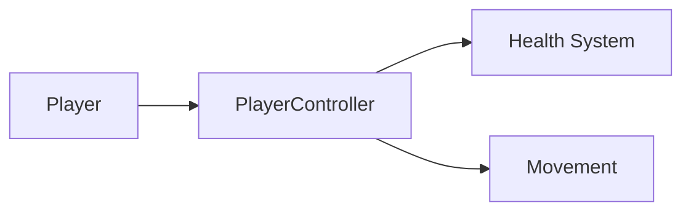

# Markdown Cheatsheet

A quick reference for everything you can use in SIGGD Docs pages. All
examples below render correctly on this site.

---

## Basic Formatting

```markdown
**bold text**
*italic text*
~~strikethrough~~
`inline code`
[Link text](https://example.com)
[Internal link](../about/index.md)
```

**bold text** · *italic text* · ~~strikethrough~~ · `inline code`

---

## Headings

```markdown
# H1 — Page title (use once per page)
## H2 — Major section
### H3 — Sub-section
#### H4 — Rarely needed
```

---

## Lists

```markdown
- Unordered item
- Another item
    - Nested item

1. Ordered item
2. Second item
    1. Nested ordered

- [x] Checked task
- [ ] Unchecked task
```

- [x] Checked task
- [ ] Unchecked task

---

## Code Blocks

````markdown
```csharp
public class PlayerController : MonoBehaviour
{
    public float speed = 5f;
}
```
````

```csharp
public class PlayerController : MonoBehaviour
{
    public float speed = 5f;
}
```

Common language identifiers: `csharp`, `gdscript`, `python`, `bash`, `yaml`,
`json`, `markdown`, `html`, `css`, `javascript`.

---

## Admonitions

```markdown
!!! tip
    A helpful tip.

!!! info "Custom Title"
    Neutral information.

!!! warning
    Be careful.

!!! danger
    Serious warning.

!!! example
    A worked example.

??? note "Collapsible note"
    Click to expand.
```

??? note "Collapsible note"
    This is the collapsed content.

---

## Tabbed Content

```markdown
=== "Tab One"
    Content for tab one.

=== "Tab Two"
    Content for tab two.
```

=== "Tab One"
    Content for tab one.

=== "Tab Two"
    Content for tab two.

---

## Tables

```markdown
| Header A | Header B |
|----------|----------|
| Cell     | Cell     |
| Cell     | Cell     |
```

| Header A | Header B |
|----------|----------|
| Cell A1  | Cell B1  |
| Cell A2  | Cell B2  |

---

## Images

```markdown

*Caption below the image.*
```

---

## Mermaid Diagrams

````markdown

````


---

## Emoji

```markdown
:material-gamepad-variant:
:material-code-braces:
:material-school:
:fontawesome/brands/github:
```

Browse all icons at [squidfunk.github.io/mkdocs-material/reference/icons-emojis](https://squidfunk.github.io/mkdocs-material/reference/icons-emojis/).

---

## Grid Cards

```markdown
<div class="grid cards" markdown>

-   :material-gamepad-variant:{ .lg .middle } **Card Title**

    ---

    Card description text.

    [:octicons-arrow-right-24: Link text](target.md)

</div>
```

---

## Keyboard Keys

```markdown
++ctrl+s++ · ++alt+f4++ · ++enter++
```

++ctrl+s++ · ++enter++

---

## Footnotes

```markdown
This sentence has a footnote.[^1]

[^1]: Footnote content goes here.
```

---

## Math (LaTeX)

Inline: `\(E = mc^2\)` renders as \(E = mc^2\)

Block:
```markdown
\[
\sum_{i=1}^{n} i = \frac{n(n+1)}{2}
\]
```
