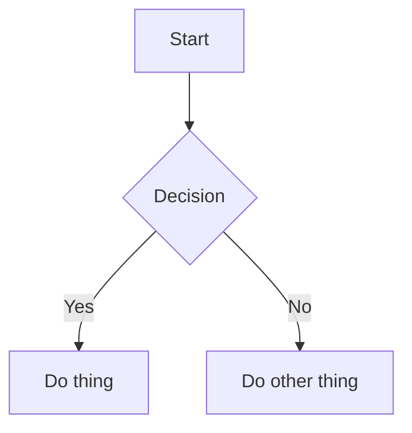

# Style Guide

Follow these conventions when contributing to keep the site consistent and
easy to read. When in doubt, match the style of existing pages.

---

## Voice and Tone

- **Second person:** Address the reader as "you." ("You will need to..." not "The user will need to...")
- **Active voice:** "Click the button" not "The button should be clicked."
- **Direct and concise:** Get to the point. Avoid padding and filler phrases.
- **Friendly, not formal:** This is club documentation, not a corporate manual. Be approachable.
- **Assume good faith:** Assume the reader wants to learn — don't write condescendingly.

---

## Headings

- Use sentence case for headings: "Getting started with Unity" not "Getting Started With Unity."
- Never skip heading levels (don't go from `##` to `####`).
- `#` (H1) is the page title — use it only once, at the top.
- `##` (H2) for major sections, `###` (H3) for sub-sections.
- Don't end headings with a period.

---

## Frontmatter

Every page must include a `title` and `description`:

```yaml
---
title: "Page Title"
description: "One concise sentence describing the page's content."
tags:
  - relevant-tag
---
```

For tutorials, also include `difficulty`, `time_estimate`, and `prerequisites`.

---

## Code Blocks

Always specify the language for syntax highlighting:

````markdown
```csharp
// C# code
```

```gdscript
# GDScript code
```

```bash
# Shell commands
```
````

Use inline code for: file paths (`Assets/Scripts/`), variable names (`playerHealth`),
menu items (`File > Save`), and short commands (`mkdocs serve`).

---

## Links

- Use descriptive link text: [Contributing Guide](index.md) not [click here](index.md).
- For internal links, use relative paths from the current file.
- For external links, always open in context — don't add `{target="_blank"}` unless
  the destination is a file download.

---

## Admonitions

Use admonitions to call out important information. Choose the right type:

```markdown
!!! tip "Optional heading"
    A helpful tip that improves the experience but isn't required.

!!! info "Optional heading"
    Neutral supplemental information.

!!! warning "Optional heading"
    Something the reader must be aware of to avoid problems.

!!! danger "Optional heading"
    A serious warning — data loss, destructive actions, etc.

!!! example "Optional heading"
    A worked example or code sample.
```

Don't overuse admonitions — if every paragraph has one, none stand out.

---

## Images

- Store images in `docs/assets/images/` or a project-specific subfolder.
- Always include alt text: ``
- Add a caption below with italic text: `*Caption explaining the image.*`
- Prefer PNG for screenshots and pixel art; JPEG for photographs.
- Keep file sizes reasonable — compress large images before committing.

---

## Tables

Use tables for structured comparisons, not for layout. Keep them simple:

```markdown
| Column A | Column B | Column C |
|----------|----------|----------|
| Value    | Value    | Value    |
```

---

## Diagrams

Use [Mermaid](https://mermaid.js.org/syntax/flowchart.html) diagrams for
system architecture and flow charts — they render natively in the site:

````markdown

````

---

## Difficulty Ratings (Tutorials)

| Rating | Meaning |
|--------|---------|
| `beginner` | No prior knowledge of the topic required |
| `intermediate` | Comfortable with the basics, ready to go deeper |
| `advanced` | Significant experience with the topic expected |

---

## Tags

Use lowercase, hyphen-separated tags from this list:

`programming` · `art` · `game-design` · `audio` · `general` · `unity` · `godot`
· `unreal` · `pixel-art` · `3d` · `animation` · `ui` · `tools` · `assets`
· `free` · `project` · `game-jam` · `tutorial` · `reference` · `setup`
· `beginner` · `intermediate` · `advanced`

Add new tags sparingly — check existing pages first to reuse established tags.
