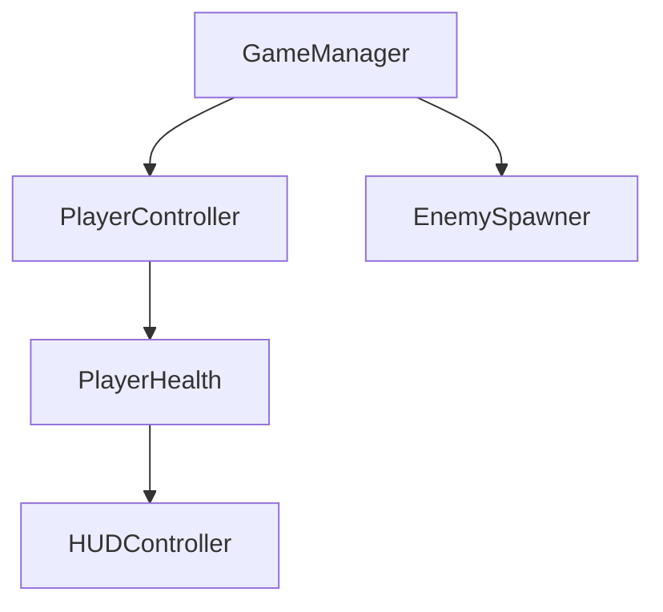

# Codebase Overview

This section is the **programmer reference guide** for [Your Project Name].
New contributors can read this before touching source code to understand how
the project is structured and where to find things.

---

## Repository Structure

Replace this with the actual folder structure using a code block:

```
Assets/
├── Scripts/
│   ├── Player/
│   │   ├── PlayerController.cs
│   │   └── PlayerHealth.cs
│   ├── Systems/
│   │   └── GameManager.cs
│   └── UI/
│       └── HUDController.cs
├── Prefabs/
├── Scenes/
│   └── MainScene.unity
└── Art/
    ├── Sprites/
    └── Animations/
```

---

## Architecture Overview

Describe the high-level design approach:

- **Entry point:** Which script/scene starts the game?
- **Patterns used:** ECS, singleton GameManager, observer pattern, etc.
- **Key design decisions:** Why was the architecture structured this way?

Add a Mermaid diagram to show the relationships between major systems:



---

## Key Systems

| System | Script | Description |
|--------|--------|-------------|
| [System Name](systems/index.md) | `SystemScript.cs` | Brief description |
| [Another System](systems/index.md) | `AnotherScript.cs` | Brief description |

---

## Dependencies

List any external packages or plugins the project depends on:

| Package | Version | Purpose |
|---------|---------|---------|
| Unity Input System | 1.7.0 | New input handling |
| TextMeshPro | 3.0.6 | UI text rendering |

---

## Local Setup

See the [Setup Guide](setup.md) for step-by-step instructions to get the
project running locally.

Quick start:

```bash
git clone https://github.com/PurdueSIGGD/your-project.git
```

1. Open in Unity Hub with **[Engine Version]**.
2. Open `Assets/Scenes/MainScene.unity`.
3. Press **Play**.

---

## See Also

- [Setup Guide](setup.md)
- [Systems Documentation](systems/index.md)
- [Script Reference](scripts/index.md)
