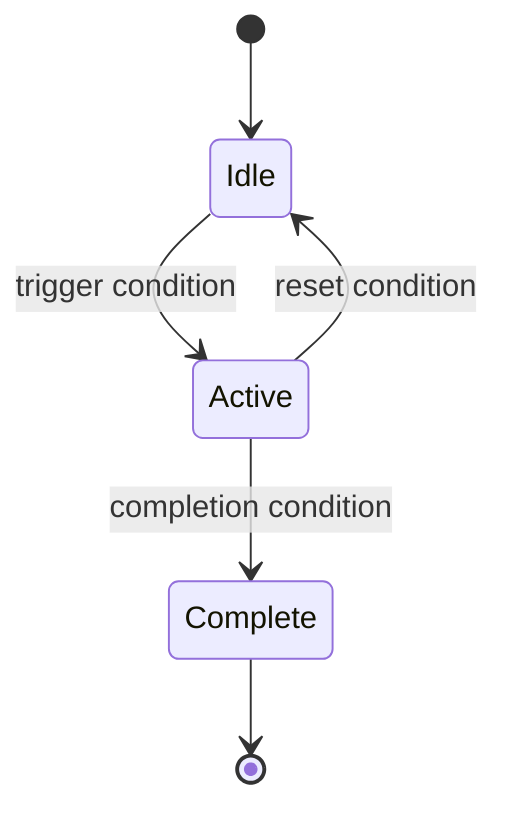

# System Name

**Script:** `Assets/Scripts/Path/SystemName.cs`  
**Namespace:** YourNamespace (or "None")  
**Dependencies:** List components or scripts this requires

One paragraph describing what this system is responsible for and the problem
it solves. Be specific — "manages player movement and animation state" is
better than "controls the player."

---

## How It Works

Describe the approach or algorithm at a conceptual level. Avoid copy-pasting
code — explain the *what* and *why*, not the *how*.

A state diagram or flowchart is especially valuable here:



---

## Public Fields (Inspector-configurable)

| Field | Type | Default | Description |
|-------|------|---------|-------------|
| `fieldName` | `float` | `1.0` | What this value controls and its effect |
| `anotherField` | `bool` | `true` | What this toggle enables |
| `someReference` | `Transform` | — | What this reference is used for |

---

## Public Methods

### `ReturnType MethodName(ParameterType paramName)`

What this method does in one sentence.

**Parameters:**

- `paramName` — What this parameter controls.

**Returns:** What the return value represents.

```csharp
// Example usage
var result = system.MethodName(someValue);
```

---

### `void AnotherMethod()`

Description of another public method.

```csharp
system.AnotherMethod();
```

---

## Events

| Event | Signature | When fired |
|-------|-----------|-----------|
| `OnEventName` | `UnityEvent<Type>` | Describe when this fires |

```csharp
// Subscribe to an event
system.OnEventName.AddListener(YourHandler);
```

---

## Configuration Tips

Practical tips for tuning this system's behavior:

- **Problem A?** Adjust `fieldName` — increasing it causes X, decreasing causes Y.
- **Problem B?** Check that the `someReference` transform is positioned correctly.

---

## Known Issues / Quirks

List any non-obvious behaviors, edge cases, or known bugs:

- **Edge case:** Describe what happens in an unusual situation.
- **Known bug:** Describe a known issue and any workaround.

---

## Called By / Calls Into

| Direction | Script | Why |
|-----------|--------|-----|
| Called by | `ScriptName.cs` | Why this script calls into this system |
| Calls into | `AnotherScript.cs` | Why this system calls into another |
