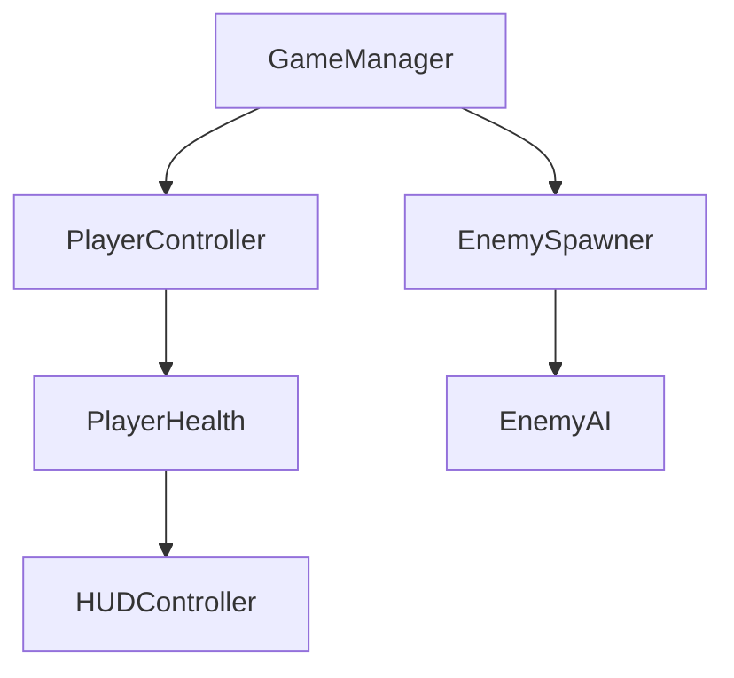

# Codebase Overview

This section is the **programmer reference guide** for Example Project. Use it
to understand the project's architecture before reading source code, or to look
up how a specific system works.

---

## Repository Structure

```
Assets/
├── Scripts/
│   ├── Player/
│   │   ├── PlayerController.cs
│   │   └── PlayerHealth.cs
│   ├── Enemies/
│   │   ├── EnemyAI.cs
│   │   └── EnemyHealth.cs
│   ├── Systems/
│   │   ├── GameManager.cs
│   │   └── SaveSystem.cs
│   └── UI/
│       ├── HUDController.cs
│       └── PauseMenu.cs
├── Prefabs/
├── Scenes/
│   ├── MainMenu.unity
│   └── Level01.unity
└── Art/
    ├── Sprites/
    └── Animations/
```

---

## Architecture Overview

Describe the high-level design patterns used in this project. For example:

- **Entry point:** `GameManager.cs` is a persistent singleton that manages
  scene transitions and global game state.
- **Pattern:** Component-based — systems are decoupled via UnityEvents and
  ScriptableObject channels rather than direct references.



---

## Key Systems

| System | Script | Description |
|--------|--------|-------------|
| Player Movement | `PlayerController.cs` | Handles input, physics, and animation states |
| Player Health | `PlayerHealth.cs` | HP tracking, damage, death, and respawn |
| Enemy AI | `EnemyAI.cs` | Patrol, detect, and chase state machine |
| Game Manager | `GameManager.cs` | Scene management and global state |
| Save System | `SaveSystem.cs` | JSON-based save/load to persistent data path |

---

## Local Setup

```bash
git clone https://github.com/PurdueSIGGD/example-project.git
```

1. Open Unity Hub and add the cloned folder as a project.
2. Open with **Unity 2022.3 LTS** (other versions may have import issues).
3. Open the scene `Assets/Scenes/Level01.unity`.
4. Press **Play** in the editor.

See [Setup Guide](setup.md) for a detailed walkthrough including required packages.

---

## See Also

- [Setup Guide](setup.md) — Getting the project running locally
- [Systems Documentation](systems/index.md) — How each game system works
- [Script Reference](scripts/index.md) — Public API for every major script
