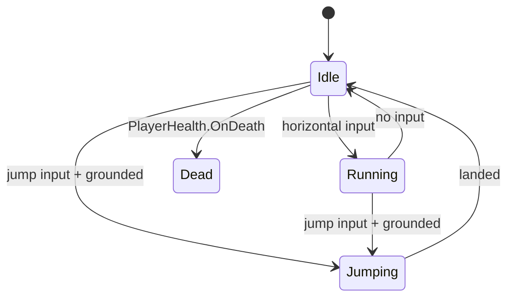

# Player Controller

**Script:** `Assets/Scripts/Player/PlayerController.cs`  
**Namespace:** None (global)  
**Dependencies:** Rigidbody2D, Animator, PlayerHealth

The `PlayerController` component handles all player input, movement physics,
and animation state transitions. It is the primary entry point for player
behavior.

---

## How It Works

The controller reads from Unity's Input System every `FixedUpdate`, applies
forces to the `Rigidbody2D`, and drives the `Animator` via integer and bool
parameters.



Ground detection uses a small `OverlapCircle` cast at the `groundCheck`
transform position each `FixedUpdate`.

---

## Public Fields

| Field | Type | Default | Description |
|-------|------|---------|-------------|
| `moveSpeed` | `float` | `5.0` | Horizontal movement speed in units/second |
| `jumpForce` | `float` | `10.0` | Impulse force applied on jump |
| `groundCheck` | `Transform` | — | Position used for ground detection raycast |
| `groundLayer` | `LayerMask` | — | Layers considered "ground" |
| `coyoteTime` | `float` | `0.1` | Seconds the player can jump after walking off a ledge |

---

## Public Methods

### `void DisableInput()`

Disables all player input. Called by `GameManager` during cutscenes and on death.

```csharp
playerController.DisableInput();
```

### `void EnableInput()`

Re-enables player input. Call after `DisableInput()` to restore control.

```csharp
playerController.EnableInput();
```

### `bool IsGrounded()`

Returns `true` if the player is currently on the ground.

```csharp
if (playerController.IsGrounded())
{
    // safe to spawn landing particles
}
```

---

## Events

| Event | Signature | When fired |
|-------|-----------|-----------|
| `OnJump` | `UnityEvent` | On every jump initiation |
| `OnLand` | `UnityEvent` | On landing after a jump |

Subscribe in the Inspector or via code:

```csharp
playerController.OnJump.AddListener(PlayJumpSound);
```

---

## Configuration Tips

- **Feels floaty?** Lower `jumpForce` or increase `Rigidbody2D.gravityScale`.
- **Feels sticky on walls?** Add a zero-friction `PhysicsMaterial2D` to the player collider.
- **Coyote time too forgiving?** Set `coyoteTime` to `0` to disable it.

---

## Called By / Calls Into

| Direction | Script | Why |
|-----------|--------|-----|
| Called by | `GameManager` | `DisableInput()` during cutscenes |
| Called by | `PlayerHealth` | `DisableInput()` on death |
| Calls into | `Animator` | Sets `Speed`, `IsGrounded`, `IsJumping` parameters |
| Calls into | `PlayerHealth` | Reads `IsAlive` before processing input |
