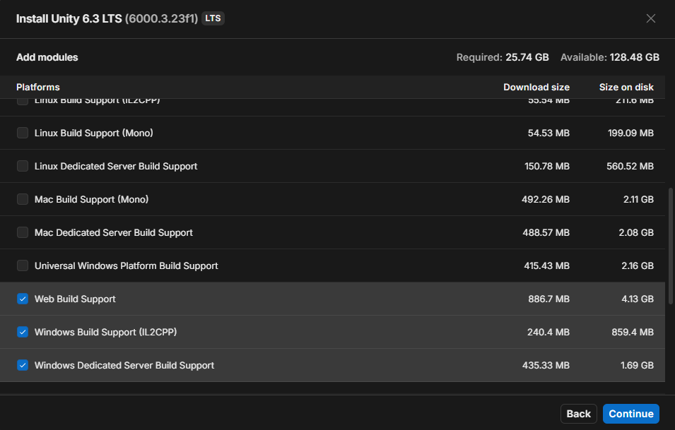
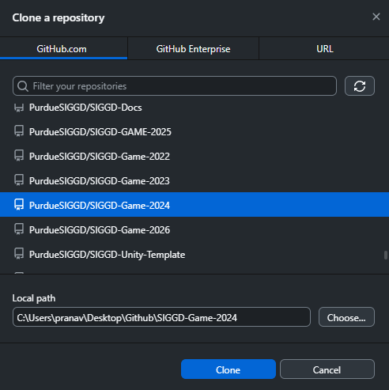
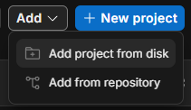
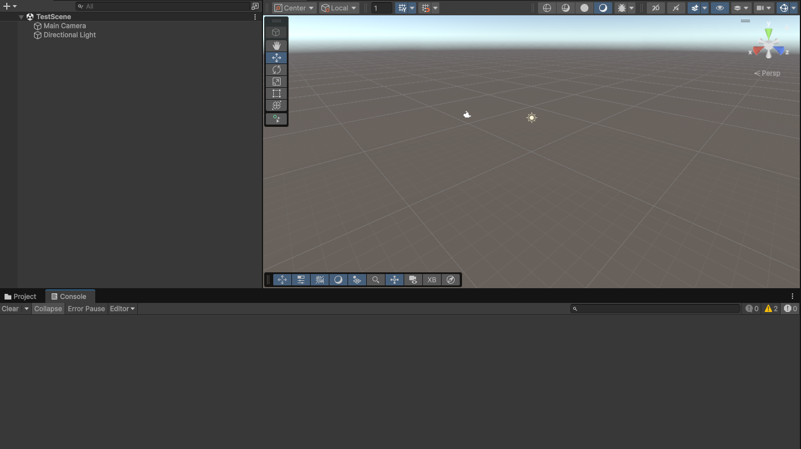

# Getting Set Up

!!! abstract "What You Will Learn"
    By the end of this guide you will:

    - Have access to the SIGGD GitHub organization
    - Have GitHub Desktop and Unity installed and signed in
    - Have the game project downloaded to your computer
    - Have the game running in the Unity editor

**Difficulty:** Beginner · **Time:** 30 minutes

---

## Introduction

Everyone who works on the game needs the same four things: a GitHub account, access to the club's organization, the project downloaded to their machine, and the right version of Unity to open it with. This guide tells you how to do that for our project!

Most of your time here will be spent waiting for downloads. This will probably take about half an hour, but only a few minutes of that is you doing anything.

!!! warning "Check your disk space first"
    Unity is roughly 10 GB installed, and the project adds a few more on top. If you're running low, clear some space before you start.

---

## Step 1: Create a GitHub Account

If you already have a GitHub account, skip this.

If you don't, go to [github.com](https://github.com) and sign up. Any username and email works.

!!! tip "Use your Purdue email if you want the student benefits"
    Signing up with your `@purdue.edu` address makes you eligible for the [GitHub Student Developer Pack](https://education.github.com/pack), which gives you a bunch of free developer tools. Not required for SIGGD, but it's free! 

---

## Step 2: Join the SIGGD Organization

The game repository lives in the **PurdueSIGGD** organization. You need to be a member of it before you can push any work.

1. Open the club Discord and go to **#join-github-organization**.
2. Post your GitHub username in the channel.
3. Our Discord bot sends you an invitation automatically.
4. Check your email (or your [GitHub notifications](https://github.com/notifications)) for the invite and accept it.

Once you've accepted, you should be able to open
[github.com/PurdueSIGGD/SIGGD-Game-2026](https://github.com/PurdueSIGGD/SIGGD-Game-2026)
and see a green **Code** button.

!!! info "Post your username, not your email"
    The bot needs your GitHub *username*, which is the name in your profile URL. If your profile is `github.com/janedoe`, your username is `janedoe`.

??? warning "The invite never showed up"
    Check the spam folder of whichever email is on your GitHub account, then check [github.com/notifications](https://github.com/notifications) directly.
    If this doesn't work, message a lead on the server and we can add you directly.

---

## Step 3: Install GitHub Desktop

**GitHub Desktop** is the app you'll use to download the project and later to save and share your work. It gives you a visual interface instead of typing commands.

1. Download it from [desktop.github.com](https://desktop.github.com/download/) and install it.
2. Open it and click **Sign in to GitHub.com**.
3. Your browser opens and asks you to authorize GitHub Desktop. Click **Authorize**.
4. Return to the app.

!!! success "How to tell it worked"
    Your GitHub username appears in the top-left corner of the window.

??? note "I'd rather use the command line"
    Very cool, but you'll need to do two things GitHub Desktop handles for you (and you also probably know how this works already lol)

    Install [Git for Windows](https://git-scm.com/download/win), or on Mac run `xcode-select --install`. Then set your identity and turn on LFS:

    ```bash
    git config --global user.name "Your Name"
    git config --global user.email "your@email.com"
    git lfs install
    ```

    Use the same email as your GitHub account so your commits are credited to you.

---

## Step 4: Install Unity

The game is built in Unity, and **everyone on the team must use the same version**. Different versions rewrite project files in incompatible ways, which creates enormous messy changes and breaks the project for everyone else.

### Install Unity Hub

**Unity Hub** manages your Unity versions and projects. Download it from [unity.com/download](https://unity.com/download) and install it.

Open it and sign in. If you don't have a Unity account, create one when prompted, and choose the **Unity Personal** license. It's free.

### Install the Right Unity Version

SIGGD Game 2026-2027 uses **Unity 6000.3.21f1**. We use this one because its LTS (long term support).

1. In Unity Hub, go to the **Installs** tab.
2. Click **Install Editor**.
3. If `6000.3.21f1` isn't in the list (it should be though), click the **Archive** tab and follow the link to the [Unity download archive](https://unity.com/releases/editor/archive) to find it. Clicking its **Unity Hub** button sends you back to the Hub with the right version selected.
4. When asked which modules to add, tick the build support for your own operating system:
    - On Windows: **Windows Build Support (IL2CPP)**
    - On Mac: **Mac Build Support (Mono)**
5. Click **Install** and wait. This is the long download.


*Tick the build support for your own operating system before installing.*

!!! tip "You can add modules later"
    If you skip a module now, you don't have to reinstall Unity. In the **Installs** tab, click the gear icon next to your version and choose **Add modules**.
    I like adding the documentation, but it's really up to you and whatever you want to do.

---

## Step 5: Download the Project

Downloading a copy of the project is called **cloning**.

1. In GitHub Desktop, go to **File &rarr; Clone Repository**.
2. Open the **GitHub.com** tab. `PurdueSIGGD/SIGGD-Game-2026` should be in the list, since you joined the organization in Step 2.
3. Under **Local Path**, pick where to put it.
4. Click **Clone** and wait for the download.


*The GitHub.com tab lists every repository you have access to. Check the Local Path before you click Clone.*

!!! danger "Do not clone into a cloud-synced folder"
    OneDrive, Dropbox, iCloud, and Google Drive all fight with Git and will corrupt the project. Windows often sets OneDrive as the default location for Documents and Desktop, so check the path carefully rather than accepting the default.

    Use a plain folder such as `C:\Projects\`.

    Don't put it inside another Git repository either.

??? note "Cloning from the command line"
    ```bash
    cd ~/YourFolder
    git clone https://github.com/PurdueSIGGD/SIGGD-Game-2026.git
    ```

---

## Step 6: Open the Project

1. In Unity Hub, go to the **Projects** tab.
2. Click **Add &rarr; Add project from disk**.
3. Select the folder you just cloned into, and click **Add Project**.
4. Click the project name to open it.



*Add → Add project from disk, then pick the folder you cloned into.*

The first time you open the project, Unity imports every asset and compiles all the code. **This takes a long time**, sometimes 10 to 20 minutes, and Unity may look frozen while it happens. That's normal. Let it finish.

Opening the project again later is much faster.

---

## Step 7: Check That It Works

Once the editor has loaded:

1. Look at the **Console** panel (**Window &rarr; General &rarr; Console** if you can't see it). Yellow warnings are fine and normal. Red errors are not.
2. Open a scene from the **Project** panel under `Assets/Scenes/`.
3. Press the **Play** button at the top of the editor.


*A correctly set up project: a scene open and no red errors in the Console.*

!!! success "You're set up"
    If the game runs when you press Play, everything is working. You're ready to start contributing.

---

## Troubleshooting

??? warning "Unity says the project was made with a different version"
    You installed the wrong Unity version. Go back to Step 4 and install **6000.3.21f1** exactly.

    Do **not** click through the prompt offering to upgrade the project. Upgrading rewrites project files for everyone, not just you, and it is very hard to undo once committed.

??? warning "Art assets look like broken images, or scripts are missing"
    This usually means Git LFS didn't fetch the real files, so you have text pointers where images should be.

    In GitHub Desktop, go to **Repository &rarr; Pull** to try again. If that doesn't fix it, open **Repository &rarr; Open in Terminal** and run:

    ```bash
    git lfs install
    git lfs pull
    ```

??? warning "I can't see the repository in GitHub Desktop"
    You're either not a member of the organization yet, or you didn't accept the invite. Revisit Step 2.

??? warning "Red errors in the Console after a fresh clone"
    Try **Assets &rarr; Reimport All** first, and let it finish.

    If errors remain, copy the full text of the first red error and ask in Discord. Chances are we messed up, so just ask one of the leads!

??? warning "Unity is stuck importing forever"
    Genuinely give it 20 minutes before assuming something is wrong I promise this is normal.

    If it's still loading well past that, close Unity, reopen the project from Unity Hub, and let it resume.

    If it STILL doesnt work, then you should probably delete the folder entirely and try the cloning process again.

---

## Next Steps

You have the project running. Yay! If you want to contribute, I recommend reading these next!

- [Git Good: First Commits](gitgood.md): make changes, save them, and share them with the team
- [Git Good: The PR Workflow](gitgood2.md): get your work reviewed and merged into the game
