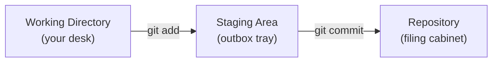
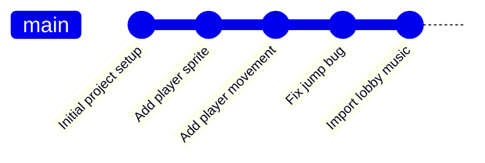
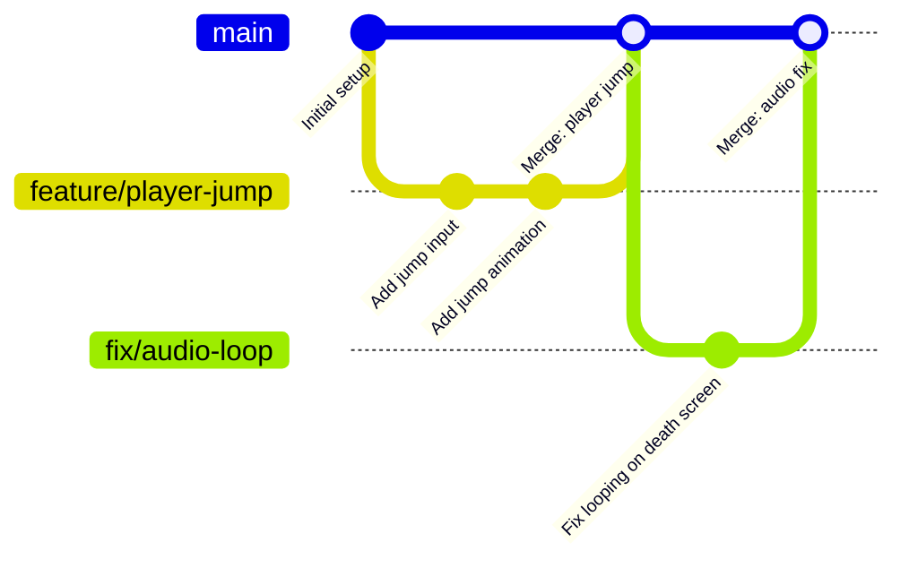

# Git Good: First Commits

!!! abstract "What You Will Learn"
    By the end of this tutorial you will be able to:

    - Explain what Git is and why game dev teams use it
    - Set up Git and GitHub Desktop on your machine
    - Clone a shared game project repository to your computer
    - Make and commit changes, then push them to GitHub
    - Create and merge branches to work without disrupting your teammates
    - Set up Git LFS to handle large art and audio assets

**Difficulty:** Beginner · **Time:** ~45 minutes

---

## Prerequisites

Before starting, make sure you have:

- [ ] A valid GitHub account ([sign up at github.com](https://github.com) if you don't have one)
- [ ] [GitHub Desktop](https://desktop.github.com/download/) downloaded (for the Desktop tab steps)

---

## Introduction

Imagine you've spent three hours getting the player movement just right. Then a teammate opens the same script, makes a change, and saves over your file. Or you try something experimental, break everything, and have no way to undo it.

**Git** is the tool that prevents all of that. It's a version control system: software that keeps a complete, permanent history of every change ever made to your project. You can undo mistakes, see who changed what, and collaborate with a whole team on the same files without anyone overwriting anyone else.

Almost every professional software and game studio uses Git. Learning it is one of the highest-value skills you can pick up as a new game dev team member.

---

## What is Git?

Git is a **version control system**. Think of it like a magic filing cabinet that:

- Remembers **every version** of every file in your project, going all the way back to the beginning
- Can **instantly restore** any previous version of any file
- Records **who changed what and when**
- Lets **multiple people** edit the same project simultaneously without overwriting each other

### Git vs GitHub

This is the most common source of confusion, so let's address it upfront:

- **Git** is the tool: software that runs on your computer and tracks changes. It works completely offline.
- **GitHub** is the cloud service: a website that hosts your Git repositories so your team can share them and access them from anywhere.

Git is the engine. GitHub is the parking lot where everyone can find the car.

You can use Git without GitHub, but GitHub needs Git.

### Key Terms

You'll encounter these words constantly. Here's a plain-English reference you can come back to:

| Term | What It Means |
|---|---|
| **Repository (repo)** | A project folder that Git is tracking, containing all your files and their entire history |
| **Commit** | A saved snapshot of your project at a point in time, with a short message describing what changed |
| **Branch** | An independent line of work, like a parallel copy of the project where you can make changes without affecting the main version |
| **Remote / Origin** | The copy of your repo stored on GitHub (what your team syncs to and from) |
| **Clone** | Downloading a complete copy of a remote repo (including all its history) to your computer |
| **Stage** | Selecting which changes to include in your next commit |
| **Push** | Uploading your local commits to GitHub |
| **Pull** | Downloading new commits from GitHub to your local copy |

Don't worry if these don't fully click yet. Each one will make much more sense once you use it.

---

## How Does Git Track Changes?

Git thinks about your work in three zones:



- **Working Directory**: the files on your computer. You edit them freely here. Git watches for changes but doesn't record them yet.
- **Staging Area**: a holding area where you decide *which* changes to include in your next commit. Think of it as an outbox tray: you're organizing what you want to save before you actually save it.
- **Repository**: the permanent record. Once you commit, the snapshot is locked in with a label, a timestamp, and your name attached.

Every time you commit, you're taking a snapshot of your project. Over time, these snapshots form a timeline:



!!! info "Why a staging area at all?"
    You might change ten files in a session but only want to commit three of them in one focused save. Staging lets you be precise. For example: you fixed a bug in `PlayerController.cs` and also started sketching out a new enemy, so you can commit just the bug fix now and commit the enemy work separately later.

---

## Setting Up

=== "GitHub Desktop"

    GitHub Desktop handles Git configuration automatically when you sign in. No separate Git installation needed.

    1. Download and install [GitHub Desktop](https://desktop.github.com/download/).
    2. Open GitHub Desktop and click **Sign in to GitHub.com**.
    3. Your browser will open and ask you to authorize GitHub Desktop. Click **Authorize**.
    4. Return to the app. GitHub Desktop reads your GitHub account name and email automatically.

    !!! info "Screenshot: GitHub Desktop welcome screen"
        *`docs/assets/images/gitgood-desktop-setup.png` (coming soon)*
        *(Shows the GitHub Desktop sign-in prompt.)*

    !!! success "You're set up"
        If you can see your username in the top-left corner of GitHub Desktop, you're ready to go.

=== "Windows (Git Bash)"

    **Step 1: Install Git**

    Download and run the [Git for Windows](https://git-scm.com/download/win) installer. The default options during installation are fine for most users.

    Once installed, open **Git Bash** from the Start menu.

    **Step 2: Configure your identity**

    Git attaches your name and email to every commit you make. Run these two commands (replace with your real name and the email you used for GitHub):

    ```bash
    git config --global user.name "Your Name"
    git config --global user.email "your@email.com"
    ```

    !!! tip "Verify it worked"
        ```bash
        git config --list
        ```
        You should see `user.name` and `user.email` in the output.

=== "Mac/Linux (Terminal)"

    **Step 1: Check if Git is installed**

    ```bash
    git --version
    ```

    If you see a version number (e.g. `git version 2.39.0`), Git is already installed.

    If not:

    - **Mac**: Run `xcode-select --install` in Terminal, or install via [Homebrew](https://brew.sh): `brew install git`
    - **Linux (Ubuntu/Debian)**: `sudo apt install git`

    **Step 2: Configure your identity**

    ```bash
    git config --global user.name "Your Name"
    git config --global user.email "your@email.com"
    ```

    Use the same email address as your GitHub account.

    !!! tip "Verify it worked"
        ```bash
        git config --list
        ```

---

## Cloning a Repository

**Cloning** means downloading a complete copy of a remote repository (all the files *and* the entire commit history) to your computer. This is usually the first thing you do when joining a project.

=== "GitHub Desktop"

    1. Go to the repository on **GitHub.com** and copy the URL from your browser's address bar.
    2. In GitHub Desktop, click **File → Clone Repository**.
    3. Click the **URL** tab and paste the repository URL.
    4. Under **Local Path**, choose where on your computer to store the project.

    !!! warning "Where to clone"
        Avoid cloning into:

        - **A cloud-synced folder** (OneDrive, Dropbox, Google Drive): these fight with Git and cause corruption and sync conflicts.
        - **Another Git repository**: nested repos cause confusing behavior.

        Use a plain folder like `C:\Projects\` or `C:\Users\YourName\GameDev\`.

    5. Click **Clone**.

    !!! info "Screenshot: Clone repository dialog"
        *`docs/assets/images/gitgood-desktop-clone.png` (coming soon)*
        *(Shows the URL tab with a repo URL pasted in and the Local Path field.)*

    GitHub Desktop downloads the project and opens it automatically.

=== "Windows (Git Bash)"

    1. Go to the repository on **GitHub.com**.
    2. Click the green **Code** button and copy the **HTTPS** URL.
    3. In Git Bash, navigate to where you want to store the project:

        ```bash
        cd C:/Projects
        ```

    4. Clone the repository:

        ```bash
        git clone https://github.com/your-org/your-repo.git
        ```

    !!! warning "Where to clone"
        Don't clone inside OneDrive, Dropbox, or another Git repository.

=== "Mac/Linux (Terminal)"

    1. Go to the repository on **GitHub.com**.
    2. Click the green **Code** button and copy the **HTTPS** URL.
    3. Navigate to where you want to store the project:

        ```bash
        cd ~/Documents/GameDev
        ```

    4. Clone the repository:

        ```bash
        git clone https://github.com/your-org/your-repo.git
        ```

    !!! warning "Where to clone"
        Don't clone inside iCloud Drive, Dropbox, or another Git repository.

---

## Making Your First Commit

You've cloned the repo. Now let's walk through the full save cycle: **make a change → stage it → write a message → commit**.

### Step 1: Open Your Repository

=== "GitHub Desktop"

    Your cloned repo should already be open. If not, click it in the left sidebar or go to **File → Open Repository**.

=== "Windows (Git Bash) / Mac/Linux (Terminal)"

    Navigate into the project folder:

    ```bash
    cd your-repo-name
    ```

### Step 2: Make a Change

Open any file in your project and edit it, or create a new file. Git doesn't care *what* you changed, and any modification to any tracked file will appear in the next step.

For example: open `PlayerController.cs` and change the jump force value, or drop a new sprite into `Assets/Sprites/`.

### Step 3: Stage Your Changes

Staging is how you tell Git: "these are the changes I want to include in my next commit."

=== "GitHub Desktop"

    After saving your edits, switch to GitHub Desktop. Your modified files appear in the **Changes** tab on the left.

    !!! info "Screenshot: GitHub Desktop main interface"
        *`docs/assets/images/gitgood-desktop-main.png` (coming soon)*
        *(Annotated view of the full interface: Changes tab, file list on the left, diff panel on the right, commit box at the bottom.)*

    !!! info "Screenshot: Staging files"
        *`docs/assets/images/gitgood-desktop-staged.png` (coming soon)*
        *(Changes tab with some files checked, some unchecked.)*

    - **Checked** files (checkmark visible) will be included in the commit.
    - **Unchecked** files are skipped for this commit.

    Check or uncheck individual files to control exactly what gets saved.

=== "Windows (Git Bash) / Mac/Linux (Terminal)"

    First, see what's changed:

    ```bash
    git status
    ```

    Stage a specific file:

    ```bash
    git add PlayerController.cs
    ```

    Or stage everything that changed:

    ```bash
    git add .
    ```

    !!! tip
        `git add .` stages all changes at once. It's fast, but check `git status` first so you know exactly what you're staging.

### Step 4: Write a Good Commit Message

A commit message is a short description of *what* you changed. It's the label on the snapshot. Future you (and your teammates) will read these when scanning history for a bug or understanding what changed.

**Good messages:**

| What you did | Good message |
|---|---|
| Added jump animation for the player | `Add player jump animation` |
| Fixed an enemy getting stuck in walls | `Fix enemy wall collision bug` |
| Imported sound effects for the main menu | `Import main menu sound effects` |
| Tweaked how fast the camera follows the player | `Smooth camera follow speed` |

**Less useful messages:** `stuff`, `wip`, `fix`, `changes`, `asdfgh`

Guidelines:
- Use **present tense**: `"Add player movement"` not `"Added player movement"`
- Be **specific**: `"Fix audio loop on death screen"` not `"Fix audio"`
- Describe **what**, not *how*: the code itself shows how

### Step 5: Commit

=== "GitHub Desktop"

    At the bottom of the Changes panel, fill in the **Summary** field with your commit message. The **Description** field is optional (use it for longer explanations).

    !!! info "Screenshot: Commit summary and button"
        *`docs/assets/images/gitgood-desktop-commit.png` (coming soon)*
        *(Summary field filled in, blue Commit button visible.)*

    Click **Commit to [branch name]**.

=== "Windows (Git Bash) / Mac/Linux (Terminal)"

    ```bash
    git commit -m "Add player jump animation"
    ```

### Step 6: Confirm

=== "GitHub Desktop"

    Click the **History** tab to see your new commit at the top.

=== "Windows (Git Bash) / Mac/Linux (Terminal)"

    ```bash
    git log --oneline
    ```

    Your latest commit appears at the top of the list.

!!! tip "Commit often, commit small"
    It's tempting to work for hours and make one massive commit. Resist this. Small, focused commits are easier to review, easier to understand later, and far easier to undo if something breaks. If you can only undo one commit's worth of work at a time, you want each commit to be a small, self-contained step.

---

## Pushing and Pulling

Your local commits only exist on your machine until you **push** them to GitHub. And when teammates push their work, you need to **pull** to get it.

### Pulling

Pulling downloads any new commits from GitHub to your local copy. **Always pull before you start working** each session to make sure you have the latest version of the project.

=== "GitHub Desktop"

    Click **Fetch origin** in the top toolbar. If there are new commits available, it changes to **Pull origin**: click again to download them.

    !!! info "Screenshot: Push/Pull toolbar"
        *`docs/assets/images/gitgood-desktop-push-pull.png` (coming soon)*
        *(Top toolbar showing the Fetch origin / Pull origin / Push origin button in its different states.)*

=== "Windows (Git Bash) / Mac/Linux (Terminal)"

    ```bash
    git pull
    ```

### Pushing

Pushing uploads your local commits to GitHub so your teammates can see your work.

=== "GitHub Desktop"

    Click **Push origin** in the top toolbar.

=== "Windows (Git Bash) / Mac/Linux (Terminal)"

    ```bash
    git push
    ```

!!! warning "Always pull before you push"
    If someone else pushed commits to the same branch since you last pulled, Git will reject your push. Pull their changes first, then push your own. GitHub Desktop will prompt you automatically if this happens.

!!! info "What is 'origin'?"
    `origin` is the default nickname Git gives to your remote repository on GitHub. When you run `git push` or `git pull`, you're communicating with `origin`, your team's GitHub copy. You'll rarely need to change this.

---

## Working with Branches

### What Is a Branch?

Imagine four teammates all committing directly to the same shared version of the game. One person commits a half-finished enemy system. Now the game is broken for everyone while they finish it.

**Branches** solve this. A branch is an isolated copy of the project where you can make changes freely. Your work stays separate until you're ready to bring it back in.

The **main branch** (usually called `main`) is the stable, always-working version everyone builds from. Each person creates their own branch for each feature or fix, then merges it back when it's done.



### Creating a Branch

=== "GitHub Desktop"

    1. Click the **Current Branch** dropdown at the top of the window.
    2. Select **New Branch**.

    !!! info "Screenshot: New branch dialog"
        *`docs/assets/images/gitgood-desktop-new-branch.png` (coming soon)*
        *(Shows the new branch name input field.)*

    3. Name the branch something descriptive. Good naming conventions:
        - `feature/player-jump`
        - `fix/enemy-collision`
        - `art/main-menu-sprites`
        - `audio/footstep-sounds`

    4. Click **Create Branch**.

=== "Windows (Git Bash) / Mac/Linux (Terminal)"

    Create a new branch and switch to it in one step:

    ```bash
    git checkout -b feature/player-jump
    ```

### Switching Branches

=== "GitHub Desktop"

    Click the **Current Branch** dropdown and select the branch you want.

    !!! info "Screenshot: Branch dropdown"
        *`docs/assets/images/gitgood-desktop-branches.png` (coming soon)*
        *(Branch dropdown open showing a list of branches.)*

=== "Windows (Git Bash) / Mac/Linux (Terminal)"

    See all branches:

    ```bash
    git branch
    ```

    Switch to a branch:

    ```bash
    git checkout feature/player-jump
    ```

!!! warning "Commit or stash before switching"
    Switching branches with uncommitted changes can cause unexpected behavior. Either commit your work first, or stash it (covered in [Git Good: The PR Workflow](gitgood2.md#stashing-changes)).

### Merging a Branch

Once your feature is complete, merge it back into `main` to share it with your teammates.

=== "GitHub Desktop"

    1. First, switch to the branch you want to merge *into* (usually `main`).
    2. Go to **Branch → Merge into Current Branch**.
    3. Select the branch containing your finished work.
    4. Click **Create a merge commit**.

=== "Windows (Git Bash) / Mac/Linux (Terminal)"

    Switch to the target branch first:

    ```bash
    git checkout main
    ```

    Then merge your feature branch:

    ```bash
    git merge feature/player-jump
    ```

### Merge Conflicts

Sometimes two people edit the same line in the same file on different branches. When you merge, Git can't automatically choose which version to keep. This is called a **merge conflict**.

Conflicts are normal. Don't panic. Git is very explicit about exactly what needs your decision.

Inside a conflicted file, you'll see markers like this:

```
<<<<<<< HEAD
float jumpForce = 8.0f;
=======
float jumpForce = 12.0f;
>>>>>>> feature/player-jump
```

- Everything between `<<<<<<< HEAD` and `=======` is from your current branch.
- Everything between `=======` and `>>>>>>>` is from the branch being merged in.

**To resolve:**

1. Decide which value to keep (or manually write a combined version).
2. Delete all the conflict markers (`<<<<<<<`, `=======`, `>>>>>>>`).
3. Save the file.
4. Stage the resolved file and commit.

=== "GitHub Desktop"

    Conflicted files appear with a warning icon in the Changes tab.

    !!! info "Screenshot: Merge conflict view"
        *`docs/assets/images/gitgood-desktop-conflict.png` (coming soon)*
        *(Files listed with conflict warning icons in the Changes tab.)*

    Click **Open in editor** on a conflicted file to resolve it, then return to GitHub Desktop to finish the merge.

=== "Windows (Git Bash) / Mac/Linux (Terminal)"

    ```bash
    git status
    ```

    Open conflicted files in your editor, resolve them, then:

    ```bash
    git add PlayerController.cs
    git commit
    ```

---

## Git LFS

### What Is Git LFS?

Git is exceptional at tracking changes in text files (code, scripts, config files). But it struggles with **binary files**: files that aren't human-readable text. Every time you update a binary file, Git stores the entire new file rather than just the difference.

In a game project, almost everything is a binary file:

- **Textures and sprites** (`.png`, `.psd`, `.tga`, `.jpg`)
- **3D models** (`.fbx`, `.blend`, `.obj`)
- **Audio files** (`.wav`, `.mp3`, `.ogg`)
- **Unity/Godot scene files and compiled assets**

Without LFS, a project with even a modest amount of art assets will balloon in size and eventually hit GitHub's 1 GB repository limit, meaning the whole team can no longer push or clone.

**Git LFS** (Large File Storage) solves this. Instead of storing large files in the repo itself, LFS puts them on GitHub's separate LFS servers and keeps only a tiny pointer (a few bytes of text) in the repo. The workflow is identical from your end: you just commit and push as normal.

!!! warning "Set up LFS before assets are committed"
    LFS tracking only applies to future commits. Files already in the repo history can't be moved to LFS retroactively without a complex migration. Configure LFS before the first art asset goes in.

### Is LFS Already Set Up?

Check for a `.gitattributes` file in the root of the repo. If it contains lines like these, LFS is already configured for those file types:

```
*.png filter=lfs diff=lfs merge=lfs -text
*.psd filter=lfs diff=lfs merge=lfs -text
*.fbx filter=lfs diff=lfs merge=lfs -text
*.wav filter=lfs diff=lfs merge=lfs -text
*.mp3 filter=lfs diff=lfs merge=lfs -text
```

If these are present, you just need to make sure LFS is installed locally (see below).

### Setting Up LFS

=== "GitHub Desktop"

    GitHub Desktop ships with Git LFS built in. When you clone a repo that uses LFS, Desktop downloads LFS files automatically.

    To **add LFS tracking for new file types**, use the CLI tab below (GitHub Desktop doesn't have a UI for `git lfs track`). You can open the built-in terminal in Desktop via **Repository → Open in Terminal**, or open Git Bash/Terminal manually and `cd` to the repo.

=== "Windows (Git Bash)"

    Install LFS support on your machine (only needed once):

    ```bash
    git lfs install
    ```

    Track file types (run from inside the repo root):

    ```bash
    git lfs track "*.png"
    git lfs track "*.psd"
    git lfs track "*.fbx"
    git lfs track "*.wav"
    git lfs track "*.mp3"
    git lfs track "*.ogg"
    ```

    This updates `.gitattributes`. Commit that file:

    ```bash
    git add .gitattributes
    git commit -m "Configure Git LFS for art and audio assets"
    git push
    ```

=== "Mac/Linux (Terminal)"

    Install Git LFS if it's not already available:

    ```bash
    # Mac (via Homebrew)
    brew install git-lfs

    # Linux (Ubuntu/Debian)
    sudo apt install git-lfs
    ```

    Then the same steps as Windows:

    ```bash
    git lfs install
    git lfs track "*.png"
    git lfs track "*.fbx"
    git lfs track "*.wav"
    git add .gitattributes
    git commit -m "Configure Git LFS for art and audio assets"
    git push
    ```

!!! tip "Track new types as needed"
    If a new type of asset enters the project (e.g., someone starts adding `.blend` files), add it: `git lfs track "*.blend"`. Commit `.gitattributes` and push: all future `.blend` commits will go through LFS.

---

## Troubleshooting

??? warning "Push rejected: 'non-fast-forward' or 'failed to push some refs'"
    **What it means:** Someone else pushed commits to this branch since you last pulled. Your local copy is behind theirs.

    **Fix:** Pull first, then push again.

    === "GitHub Desktop"
        Click **Pull origin** (or **Fetch origin** then **Pull**). Resolve any conflicts if prompted. Then click **Push origin**.

    === "CLI"
        ```bash
        git pull
        git push
        ```

??? warning "'Please tell me who you are' / 'Author identity unknown'"
    **What it means:** Git can't attribute your commit because your name and email haven't been configured.

    **Fix:**

    ```bash
    git config --global user.name "Your Name"
    git config --global user.email "your@email.com"
    ```

    Then retry your commit.

??? warning "I committed to main by mistake"
    **What it means:** You made a commit directly to `main` instead of your feature branch.

    **Fix (if not yet pushed):**

    === "CLI"
        1. Create a new branch from your current state (this carries your commit with it):
            ```bash
            git checkout -b feature/my-actual-branch
            ```
        2. Switch back to `main` and undo the commit there (keeps your changes, just un-commits them from `main`):
            ```bash
            git checkout main
            git reset HEAD~1
            ```

        Your work is now on the correct feature branch and `main` is clean.

    === "GitHub Desktop"
        1. Before doing anything else, create a new branch (**Current Branch → New Branch**), which will start from your current position including the accidental commit.
        2. Switch back to `main`.
        3. In the **History** tab, right-click the accidental commit and choose **Undo Commit**.

    !!! warning "If you already pushed to main"
        If `main` is branch-protected (requires PRs), the push would have been blocked. If it went through, coordinate with your team lead before reverting, as force-pushing a shared branch affects everyone.

??? warning "'Already up to date' but I can't see my teammate's changes"
    **What it means:** You're on the wrong branch. `git pull` only updates the branch you're currently on.

    **Fix:**

    === "GitHub Desktop"
        Check the **Current Branch** dropdown. Switch to the branch where your teammate pushed their changes, then **Fetch origin** / **Pull origin**.

    === "CLI"
        ```bash
        git branch          # see which branch you're on (starred)
        git checkout main   # switch to the correct branch
        git pull
        ```

??? warning "Merge conflict markers won't go away"
    **What it means:** The conflict markers (`<<<<<<<`, `=======`, `>>>>>>>`) are still literally in the file: they weren't removed before you staged and tried to commit.

    **Fix:** Open the conflicted file in your editor. Search for `<<<<<<<`. Remove all three conflict markers and leave only the final, correct code. Then:

    ```bash
    git add filename.cs
    git commit
    ```

---

## Next Steps

After completing this tutorial, try:

- [Git Good: The PR Workflow](../general/gitgood2.md): learn how to open pull requests, get code reviewed, and use advanced Git techniques

---

## Further Reading

- [Pro Git (free book)](https://git-scm.com/book/en/v2): the definitive reference for everything Git; the first few chapters are very readable for beginners.
- [GitHub Docs: Getting started](https://docs.github.com/en/get-started): GitHub's official beginner guide with interactive walkthroughs.
- [Oh Shit, Git!?!](https://ohshitgit.com/): plain-English solutions to common Git mistakes.
