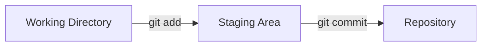
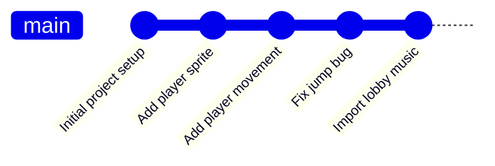
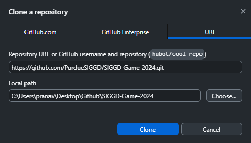
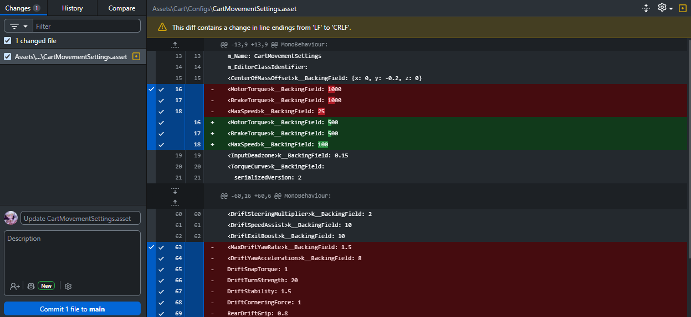
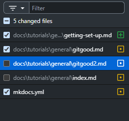
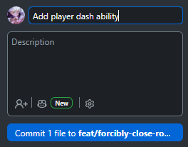
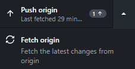
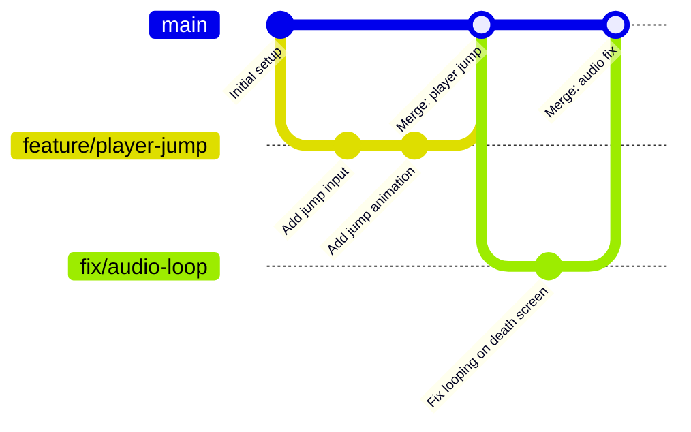
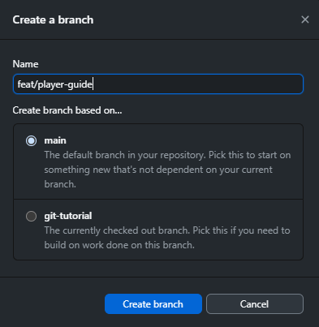
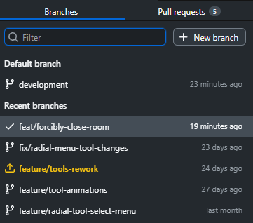

# Git Good: First Commits

!!! abstract "What You Will Learn"
    By the end of this tutorial you will:

    - Understand what Git is
    - Set up Git and GitHub Desktop on your machine
    - Clone a shared game project repository to your computer
    - Make and commit changes, then push them to GitHub
    - Create and merge branches to work without disrupting your teammates
    - Set up Git LFS to handle large art and audio assets

**Difficulty:** Beginner · **Time:** 45 minutes

---

## Prerequisites

Before starting, make sure you have:

- [ ] A valid GitHub account ([sign up at github.com](https://github.com) if you don't have one)
- [ ] [GitHub Desktop](https://desktop.github.com/download/) downloaded (if you'd rather work with a visual interface)

---

## Introduction

Imagine you've spent three hours working on a piece of code for a feature, then a teammate opens the same script, makes a change, and saves over your file. Or you try something experimental, break everything, and have no way to undo it.

**Git** is the industry standard tool that prevents all of that. With Git, you can undo mistakes, see who changed what, and collaborate with a whole team on the same files without anyone overwriting anyone else.

On the surface, especially as someone who's never used it before, Git can seem daunting, but once you learn more about it, it can become your best friend when developing. This guide will teach you about both Git and GitHub (they are indeed different), walking you through the steps of successfully using it in a game development environment here at SIGGD!

These first few sections teach you about what Git and GitHub really are, but if you just want to collaborate with our team, feel free to skip ahead to [Setting Up](#setting-up)!

---

## What is Git?

Git is a **version control system**. Think of it like a filing cabinet that:

- Remembers **every version** of every file in your project, going all the way back to the beginning
- Can **instantly restore** any previous version of any file
- Records **who changed what and when**
- Lets **multiple people** edit the same project simultaneously without overwriting each other

### Git vs GitHub

Many people get this wrong, but Git and GitHub are separate entities that are both necessary for our game development workflow:

- **Git** is merely a tool, software that runs on your computer and tracks changes that works completely offline.
- **GitHub** is the cloud service, a website that stores the files you track with Git so your team can share them and access them from anywhere.

You can use Git without GitHub completely locally on your computer, but GitHub needs Git. We recommend syncing all your Git repositories to a cloud service like GitHub, but its perfectly feasible to host your own servers or just keep everything locally!

### Key Terms

You'll encounter these words constantly. Here's a plain-English reference you can come back to:

| Term | What It Means |
|---|---|
| **Repository (repo)** | A project folder that Git is tracking, containing all your files and their entire history |
| **Commit** | A saved snapshot of your project at a point in time, with a short message describing what changed |
| **Branch** | An independent line of work, like a parallel copy of the project where you can make changes without affecting the main version |
| **Remote / Origin** | The copy of your repo stored on GitHub (what your team syncs to and from) |
| **Clone** | Downloading a complete copy of a remote repo (including all its history) to your computer |
| **Stage** | Selecting which changes to include in your next commit |
| **Push** | Uploading your local commits to GitHub |
| **Pull** | Downloading new commits from GitHub to your local copy |

Don't worry if these don't fully click yet. Each one will make much more sense once you use it.

---

## How Does Git Track Changes?

Git thinks about your work in three zones:


```mermaid
flowchart LR
    A["Working Directory"]
    B["Staging Area"]
    C["Repository"]
    A -- "git add" --> B
    B -- "git commit" --> C
```

- **Working Directory**: the files on your computer. You edit them freely here. Git watches for changes but doesn't record them yet.
- **Staging Area**: a holding area where you decide *which* changes to include in your next commit. You don't need to sync all your files with the repository, just whatever you choose.
- **Repository**: the permanent record. Once you commit, the snapshot is locked in with a label, a timestamp, and your name attached.

Every time you commit, you're taking a snapshot of your project. Over time, these snapshots form a timeline:


```mermaid
gitGraph
   commit id: "Initial project setup"
   commit id: "Add player sprite"
   commit id: "Add player movement"
   commit id: "Fix jump bug"
   commit id: "Import lobby music"
```

!!! info "Why a staging area at all?"
    You might change ten files in a session but only want to commit three of them in one focused save. Staging lets you be precise. For example: you fixed a bug in `PlayerController.cs` and also started sketching out a new enemy, so you can commit just the bug fix now and commit the enemy work separately later.

---

## Setting Up

=== "GitHub Desktop"

    GitHub Desktop handles Git configuration automatically when you sign in. No separate Git installation needed.

    1. Download and install [GitHub Desktop](https://desktop.github.com/download/).
    2. Open GitHub Desktop and click **Sign in to GitHub.com**.
    3. Your browser will open and ask you to authorize GitHub Desktop. Click **Authorize**.
    4. Return to the app. GitHub Desktop reads your GitHub account name and email automatically.

    !!! success "You're set up"
        If you can see your username in the top-left corner of GitHub Desktop, you're ready to go.

=== "Windows (Git Bash)"

    **Step 1: Install Git**

    Download and run the [Git for Windows](https://git-scm.com/download/win) installer. The default options during installation are fine for most users.

    Once installed, open **Git Bash** from the Start menu.

    **Step 2: Configure your identity**

    Git attaches your name and email to every commit you make. Run these two commands (replace with your real name and the email you used for GitHub):

    ```bash
    git config --global user.name "Your Name"
    git config --global user.email "your@email.com"
    ```

    !!! tip "Verify it worked"
        ```bash
        git config --list
        ```
        You should see `user.name` and `user.email` in the output.

=== "Mac/Linux (Terminal)"

    **Step 1: Check if Git is installed**

    ```bash
    git --version
    ```

    If you see a version number (e.g. `git version 2.39.0`), Git is already installed.

    If not:

    - **Mac**: Run `xcode-select --install` in Terminal, or install via [Homebrew](https://brew.sh): `brew install git`
    - **Linux (Ubuntu/Debian)**: `sudo apt install git`

    **Step 2: Configure your identity**

    ```bash
    git config --global user.name "Your Name"
    git config --global user.email "your@email.com"
    ```

    Use the same email address as your GitHub account.

    !!! tip "Verify it worked"
        ```bash
        git config --list
        ```

---

## Cloning a Repository

**Cloning** means downloading a complete copy of a remote repository (all the files *and* the entire commit history) to your computer. This is usually the first thing you do when joining a project.

=== "GitHub Desktop"

    1. Go to the repository on **GitHub.com** and copy the URL from your browser's address bar.
    2. In GitHub Desktop, click **File &rarr; Clone Repository**.
    3. Click the **URL** tab and paste the repository URL.
    4. Under **Local Path**, choose where on your computer to store the project.

    !!! warning "Where to clone"
        Avoid cloning into:

        - **A cloud-synced folder** (OneDrive, Dropbox, Google Drive): these fight with Git and cause corruption and sync conflicts.
        - **Another Git repository**: nested repos cause confusing behavior (with the exception of submodules, which we aren't addressing in this tutorial).

        Use a plain folder like `C:\Projects\` or `C:\Users\YourName\GameDev\`.

    5. Click **Clone**.

    

    *Paste the repository URL, then choose a Local Path outside any cloud-synced folder.*

    GitHub Desktop downloads the project and opens it automatically.

=== "Windows (Git Bash)"

    1. Go to the repository on **GitHub.com**.
    2. Click the green **Code** button and copy the **HTTPS** URL.
    3. In Git Bash, navigate to where you want to store the project:

        ```bash
        cd C:/Projects
        ```

    4. Clone the repository:

        ```bash
        git clone https://github.com/your-org/your-repo.git
        ```

    !!! warning "Where to clone"
        Don't clone inside OneDrive, Dropbox, or another Git repository.

=== "Mac/Linux (Terminal)"

    1. Go to the repository on **GitHub.com**.
    2. Click the green **Code** button and copy the **HTTPS** URL.
    3. Navigate to where you want to store the project:

        ```bash
        cd ~/Documents/GameDev
        ```

    4. Clone the repository:

        ```bash
        git clone https://github.com/your-org/your-repo.git
        ```

    !!! warning "Where to clone"
        Don't clone inside iCloud Drive, Dropbox, or another Git repository.

---

## Making Your First Commit

You've cloned the repo. Now let's walk through the full save cycle: **make a change &rarr; stage it &rarr; write a message &rarr; commit**.

### Step 1: Open Your Repository

=== "GitHub Desktop"

    Your cloned repo should already be open. If not, click it in the left sidebar or go to **File &rarr; Open Repository**.

=== "Windows (Git Bash) / Mac/Linux (Terminal)"

    Navigate into the project folder:

    ```bash
    cd your-repo-name
    ```

### Step 2: Make a Change

Open any file in your project and edit it, or create a new file. Git doesn't care *what* you changed, and any modification to any tracked file will appear in the next step.

For example: open `PlayerController.cs` and change the jump force value, or drop a new sprite into `Assets/Sprites/`.

!!! tip
    Unity is notoriously bad at writing file changes to your hard disk, especially for things like .meta files and .asset files, which means that sometimes Git doesn't notice your changes. To fix this and force-sync everything, navigate to **File &rarr; Save Project**.

### Step 3: Stage Your Changes

Staging is how you tell Git: "these are the changes I want to include in my next commit."

=== "GitHub Desktop"

    After saving your edits, switch to GitHub Desktop. Your modified files appear in the **Changes** tab on the left.

    
    *The four areas you will use constantly.*

    

    *Only the checked files go into your next commit.*

    - **Checked** files will be included in the commit.
    - **Unchecked** files are skipped for this commit.

    Check or uncheck individual files to control exactly what gets saved.

=== "Windows (Git Bash) / Mac/Linux (Terminal)"

    First, see what's changed:

    ```bash
    git status
    ```

    Stage a specific file:

    ```bash
    git add PlayerController.cs
    ```

    Or stage everything that changed:

    ```bash
    git add .
    ```

    !!! tip
        `git add .` stages all changes at once. It's fast, but check `git status` first so you know exactly what you're staging. You can also use regular expressions to stage multiple similar files at once.

### Step 4: Write a Good Commit Message

A commit message is a short description of *what* you changed. It's the label on the snapshot. Future you (and your teammates) will read these when scanning history for a bug or understanding what changed.

**Good messages:**

| What you did | Good message |
|---|---|
| Added jump animation for the player | `Add player jump animation` |
| Fixed an enemy getting stuck in walls | `Fix enemy wall collision bug` |
| Imported sound effects for the main menu | `Import main menu sound effects` |
| Tweaked how fast the camera follows the player | `Smooth camera follow speed` |

**Less useful messages:** `stuff`, `wip`, `fix`, `changes`, `asdfgh`

Typical Guidelines:

- Use **present tense**: `"Add player movement"` not `"Added player movement"`
- Be **specific**: `"Fix audio loop on death screen"` not `"Fix audio"`
- Describe **what**, not *how*: the code itself shows how

!!! note "An aside for SIGGD"
    We'd really appreciate if you made your commit messages as descriptive as possible following these rules! A large part of software development is communication, and it makes everything much nicer and saves a ton of time!

### Step 5: Commit

=== "GitHub Desktop"

    At the bottom of the Changes panel, fill in the **Summary** field with your commit message. The **Description** field is optional (use it for longer explanations).

    

    *The button names the branch you are committing to. Check that it says what you expect.*

    Click **Commit to [branch name]**.

=== "Windows (Git Bash) / Mac/Linux (Terminal)"

    ```bash
    git commit -m "Add player jump animation"
    ```

### Step 6: Confirm

=== "GitHub Desktop"

    Click the **History** tab to see your new commit at the top.

=== "Windows (Git Bash) / Mac/Linux (Terminal)"

    ```bash
    git log --oneline
    ```

    Your latest commit appears at the top of the list.

!!! tip "Commit often, commit small"
    It's tempting to work for hours and make one massive commit. Don't do that. Small, focused commits are easier to review, easier to understand later, and far easier to undo if something breaks. If you can only undo one commit's worth of work at a time, you want each commit to be a small, self-contained step. This will save you a LOT of trouble in the future I promise.

---

## Pushing and Pulling

Your local commits only exist on your machine until you **push** them to GitHub. And when teammates push their work, you need to **pull** to get it.

### Pulling

Pulling downloads any new commits from GitHub to your local copy. **Always pull before you start working** each session to make sure you have the latest version of the project.

=== "GitHub Desktop"

    Click **Fetch origin** in the top toolbar. If there are new commits available, it changes to **Pull origin**: click again to download them.

    

    *The same button changes label depending on what is waiting.*

=== "Windows (Git Bash) / Mac/Linux (Terminal)"

    ```bash
    git pull
    ```

### Pushing

Pushing uploads your local commits to GitHub so your teammates can see your work.

=== "GitHub Desktop"

    Click **Push origin** in the top toolbar.

=== "Windows (Git Bash) / Mac/Linux (Terminal)"

    ```bash
    git push
    ```

!!! warning "Always pull before you push"
    If someone else pushed commits to the same branch since you last pulled, Git will reject your push. Pull their changes first, then push your own. GitHub Desktop will prompt you automatically if this happens.

!!! info "What is 'origin'?"
    `origin` is the default nickname Git gives to your remote repository on GitHub. When you run `git push` or `git pull`, you're communicating with `origin`, your team's GitHub copy. You'll rarely need to change this.

---

## Working with Branches

### What Is a Branch?

Imagine four teammates all committing directly to the same shared version of the game. One person commits a half-finished system. Now the game is broken for everyone while they finish it.

**Branches** solve this. A branch is an isolated copy of the project where you can make changes freely. Your work stays separate until you're ready to bring it back in.

The **main branch** (usually called `main`) is the stable, always-working version everyone builds from. Each person creates their own branch for each feature or fix, then merges it back when it's done.


```mermaid
gitGraph
   commit id: "Initial setup"
   branch feature/player-jump
   checkout feature/player-jump
   commit id: "Add jump input"
   commit id: "Add jump animation"
   checkout main
   merge feature/player-jump id: "Merge: player jump"
   branch fix/audio-loop
   checkout fix/audio-loop
   commit id: "Fix looping on death screen"
   checkout main
   merge fix/audio-loop id: "Merge: audio fix"
```
To read the diagram above, look from left to right. The blue branch is our `main` branch, where everything will ultimately be merged into. The yellow branch, where someone presumably creates a feature for player jumping (descriptive branch name!), has 2 commits, then is merged into main. The fix for audio looping is similarly made and merged into main with just one commit. As a result, both developers can work on separate features in parallel!

### Creating a Branch

=== "GitHub Desktop"

    1. Click the **Current Branch** dropdown at the top of the window.
    2. Select **New Branch**.
    3. You will be asked what branch to base your new one off of; this just means which branch's history your new branch will inherit (you can view this in the history tab). Select whatever fits your needs, but most of the time this will be `main`.

    
    *Name the branch descriptively, and base it on main unless you have a reason not to.*

    4. Name the branch something descriptive. SIGGD uses these prefixes:
        - `feature/player-jump`: new mechanics, systems, screens
        - `fix/enemy-collision`: bug fixes
        - `art/main-menu-sprites`: sprites, models, animations, VFX
        - `audio/footstep-sounds`: music and sound effects

    5. Click **Create Branch**.

=== "Windows (Git Bash) / Mac/Linux (Terminal)"

    Create a new branch and switch to it in one step:

    ```bash
    git checkout -b feature/player-jump
    ```

### Switching Branches

=== "GitHub Desktop"

    Click the **Current Branch** dropdown and select the branch you want.

    
    *Switching branches swaps the files on your disk to match that branch.*

=== "Windows (Git Bash) / Mac/Linux (Terminal)"

    See all branches:

    ```bash
    git branch
    ```

    Switch to a branch:

    ```bash
    git checkout feature/player-jump
    ```

!!! warning "Commit or stash before switching"
    Switching branches with uncommitted changes can cause unexpected behavior. Either commit your work first, or stash it (covered in [Git Good: The PR Workflow](gitgood2.md#stashing-changes)).

### Updating Your Branch from `main`

While you work on your branch, teammates keep merging their own work into `main`. Bringing those changes into your branch keeps you current and surfaces conflicts early, while they are still small.

!!! danger "You cannot merge your own branch into main"
    In SIGGD, nobody pushes or merges directly into `main`. It is protected, and the only way your work gets in is through a pull request that someone reviews and approves. That is covered in [Git Good: The PR Workflow](gitgood2.md#opening-a-pull-request).

    So this section covers the direction you *will* use constantly: merging `main` **into your branch**.

=== "GitHub Desktop"

    1. First, switch to the branch you want to merge *into* (here, it will be your feature branch).
    2. Go to **Branch &rarr; Merge into Current Branch**.
    3. Select the branch you want to merge changes from (in this case `main`).
    4. Click **Create a merge commit**.

=== "Windows (Git Bash) / Mac/Linux (Terminal)"

    Switch to the feature branch first:

    ```bash
    git checkout feature/player-jump
    ```

    Then merge in `main`:

    ```bash
    git merge main
    ```

### Merge Conflicts

Sometimes two people edit the same line in the same file on different branches. When you merge, Git can't automatically choose which version to keep. This is called a **merge conflict**.

Conflicts are normal. Don't panic. Git is very explicit about exactly what needs your decision.

Inside a conflicted (text) file, you'll see markers like this:

```
<<<<<<< HEAD
float jumpForce = 8.0f;
=======
float jumpForce = 12.0f;
>>>>>>> feature/player-jump
```

- Everything between `<<<<<<< HEAD` and `=======` is from your current branch.
- Everything between `=======` and `>>>>>>>` is from the branch being merged in.

**To resolve:**

1. Decide which value to keep (or manually write a combined version).
2. Delete all the conflict markers (`<<<<<<<`, `=======`, `>>>>>>>`).
3. Save the file.
4. Stage the resolved file and commit.

=== "GitHub Desktop"

    Conflicted files appear with a warning icon in the Changes tab.

    Click **Open in editor** on a conflicted file to resolve it, then return to GitHub Desktop to finish the merge.

=== "Windows (Git Bash) / Mac/Linux (Terminal)"

    ```bash
    git status
    ```

    Open conflicted files in your editor, resolve them, then:

    ```bash
    git add PlayerController.cs
    git commit
    ```

!!! warning "Merge conflicts with non-text files"
    The vast majority of files we will use in SIGGD won't be as nice as code files, which are human readable, instead being **binary files** (see the next section). Binary files aren't human readable, which mean you can't edit it line by line. Thus, it is extra important that you use version control to ensure that no one's work gets lost.
---

## Git LFS

### What Is Git LFS?

Git is exceptional at tracking changes in text files (code, scripts, config files). But it struggles with **binary files**: files that aren't human-readable text. Every time you update a binary file, Git stores the entire new file rather than just the difference.

In a game project, almost everything is a binary file:

- **Textures and sprites** (`.png`, `.psd`, `.tga`, `.jpg`)
- **3D models** (`.fbx`, `.blend`, `.obj`)
- **Audio files** (`.wav`, `.mp3`, `.ogg`)
- **Unity scene files and compiled assets**

Without LFS, a repo full of art assets balloons in size. GitHub rejects any single file over 100 MB outright, and a repo that keeps every version of every texture gets slower to clone for everyone, forever.

**Git LFS** (Large File Storage) solves this. Instead of storing large files in the repo itself, LFS puts them on GitHub's separate LFS servers and keeps only a tiny pointer (a few lines of text) in the repo. The workflow is identical from your end: you just commit and push as normal.

### LFS in the SIGGD Game Repo

**LFS is already set up.** You do not need to configure anything. `.gitattributes` in the repo root already routes every art, audio, model, and video format through LFS.

The only thing you need to do is install LFS support on your own machine:

```bash
git lfs install
```

GitHub Desktop ships with Git LFS built in, so if that's all you use, this is already done for you.

!!! danger "If you skip this, you will commit broken assets"
    Without LFS installed, art files download as a few lines of text instead of actual images, and anything you commit gets stored the wrong way. If you open a sprite and see this, LFS is not installed:

    ```
    version https://git-lfs.github.com/spec/v1
    oid sha256:4d7a2...
    size 4194304
    ```

    Run `git lfs install`, then `git lfs pull` to fetch the real files.

!!! warning "Storage is shared across the whole club"
    SIGGD's GitHub account gets 10 GB of LFS storage and 10 GB of downloads per month, shared across **every** PurdueSIGGD repository. Every fresh clone spends from that same monthly pool.

    In practice this means: don't commit raw 4K footage, 40-layer PSDs, or uncompressed WAVs when a smaller version would do. Once the pool runs out, LFS stops working for everybody until the next month.

??? note "Setting up LFS in your own project"
    You won't need this for SIGGD's repo, but it's useful for game jams and personal projects.

    Install LFS, then tell it which file types to track from inside the repo root:

    ```bash
    git lfs install
    git lfs track "*.png"
    git lfs track "*.psd"
    git lfs track "*.fbx"
    git lfs track "*.wav"
    ```

    On Mac you may need to install LFS itself first with `brew install git-lfs`; on Ubuntu/Debian, `sudo apt install git-lfs`.

    Tracking writes to `.gitattributes`, which has to be committed like any other file:

    ```bash
    git add .gitattributes
    git commit -m "Configure Git LFS for art and audio assets"
    git push
    ```

    !!! warning "Set up LFS before assets are committed"
        LFS tracking only applies to future commits. Files already in the repo history can't be moved to LFS retroactively without a complex migration. Configure LFS before the first art asset goes in.

---

## Troubleshooting

??? warning "Push rejected: 'non-fast-forward' or 'failed to push some refs'"
    **What it means:** Someone else pushed commits to this branch since you last pulled. Your local copy is behind theirs.

    **Fix:** Pull first, then push again.

    === "GitHub Desktop"
        Click **Pull origin** (or **Fetch origin** then **Pull**). Resolve any conflicts if prompted. Then click **Push origin**.

    === "CLI"
        ```bash
        git pull
        git push
        ```

??? warning "'Please tell me who you are' / 'Author identity unknown'"
    **What it means:** Git can't attribute your commit because your name and email haven't been configured.

    **Fix:**

    ```bash
    git config --global user.name "Your Name"
    git config --global user.email "your@email.com"
    ```

    Then retry your commit.

??? warning "I committed to main by mistake"
    **What it means:** You made a commit directly to `main` instead of your feature branch.

    **Fix (if not yet pushed):**

    === "CLI"
        1. Create a new branch from your current state (this carries your commit with it):
            ```bash
            git checkout -b feature/my-actual-branch
            ```
        2. Switch back to `main` and undo the commit there (keeps your changes, just un-commits them from `main`):
            ```bash
            git checkout main
            git reset HEAD~1
            ```

        Your work is now on the correct feature branch and `main` is clean.

    === "GitHub Desktop"
        1. Before doing anything else, create a new branch (**Current Branch &rarr; New Branch**), which will start from your current position including the accidental commit.
        2. Switch back to `main`.
        3. In the **History** tab, right-click the accidental commit and choose **Undo Commit**.

    !!! warning "If you already pushed to main"
        At least in SIGGD, this won't happen because we have branch protections. If something really drastic happened though, coordinate with the person in charge of the GitHub repository to fix this!

??? warning "'Already up to date' but I can't see my teammate's changes"
    **What it means:** You're on the wrong branch. `git pull` only updates the branch you're currently on.

    **Fix:**

    === "GitHub Desktop"
        Check the **Current Branch** dropdown. Switch to the branch where your teammate pushed their changes, then **Fetch origin** / **Pull origin**.

    === "CLI"
        ```bash
        git branch          # see which branch you're on (starred)
        git checkout main   # switch to the correct branch
        git pull
        ```

??? warning "Merge conflict markers won't go away"
    **What it means:** The conflict markers (`<<<<<<<`, `=======`, `>>>>>>>`) are still literally in the file: they weren't removed before you staged and tried to commit.

    **Fix:** Open the conflicted file in your editor. Search for `<<<<<<<`. Remove all three conflict markers and leave only the final, correct code. Then:

    ```bash
    git add filename.cs
    git commit
    ```

---

## Next Steps

After completing this tutorial, try:

- [Git Good: The PR Workflow](../general/gitgood2.md): learn how to open pull requests, get code reviewed, and use advanced Git techniques

---

## Further Reading

- [Pro Git (free book)](https://git-scm.com/book/en/v2): the definitive reference for everything Git; the first few chapters are very readable for beginners.
- [GitHub Docs: Getting started](https://docs.github.com/en/get-started): GitHub's official beginner guide with interactive walkthroughs.
- [Oh Shit, Git!?!](https://ohshitgit.com/): plain-English solutions to common Git mistakes.
