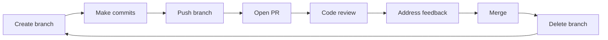
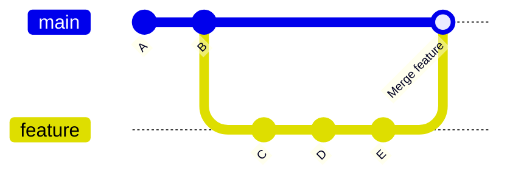
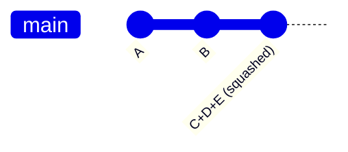
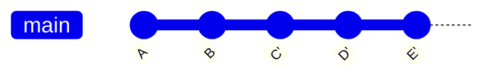

# Git Good: The PR Workflow

!!! abstract "What You Will Learn"
    By the end of this tutorial you will be able to:

    - Open and describe a pull request (PR) on GitHub
    - Give and receive code review like a professional
    - Understand the difference between merge, squash, and rebase, and when to use each
    - Keep your branch in sync with `main` while your PR is open
    - Use `git stash`, `git revert`, and interactive rebase to keep your history clean
    - Understand branch protection rules and CI status checks

**Difficulty:** Intermediate · **Time:** ~45 minutes

---

## Prerequisites

Before starting, make sure you have:

- [ ] Completed [Git Good: First Commits](gitgood.md) or are already comfortable with basic Git
- [ ] Access to a shared GitHub repository (your SIGGD game project)

---

## Introduction

You know how to make commits and push branches. Now it's time to learn how those changes actually get into the shared codebase.

The **pull request (PR) workflow** is the standard way professional teams collaborate: instead of pushing directly to `main`, you open a PR that lets teammates review your work, leave feedback, and approve it before it's merged. This catches bugs earlier, shares knowledge across the team, and keeps the shared build stable.

This tutorial covers the entire PR lifecycle: opening it, filling it out, getting reviewed, responding to feedback, and merging cleanly. It also covers several advanced Git techniques you'll reach for regularly once you're working on an active project.

---

## The PR Workflow at a Glance

Every feature or fix you work on follows this loop:



This loop repeats for every change, big or small. An hour of work and a week of work follow the same process. The PR is where your isolated branch becomes part of the shared game.

!!! tip
    The more often you complete this loop, the smoother everything runs. Small, frequent PRs are much easier to review than massive ones that touch every corner of the project.

---

## Opening a Pull Request

Once you've pushed your branch to GitHub, you can open a PR.

=== "GitHub (web)"

    1. Go to your repository on **GitHub.com**.
    2. GitHub often shows a yellow banner: **"Your branch had recent pushes. Compare & pull request."** Click that button.
       - If the banner isn't there: click the **Pull requests** tab → **New pull request**.
    3. Set the **base** branch to `main` (the branch you want to merge *into*) and the **compare** branch to your feature branch.
    4. Click **Create pull request**.

    !!! info "Screenshot: PR creation"
        *`docs/assets/images/gitgood2-pr-open.png` (coming soon)*
        *(Shows the "Compare & pull request" banner or the PR creation form with base/compare dropdowns.)*

=== "GitHub Desktop"

    After pushing your branch, GitHub Desktop shows a **"Create Pull Request"** button in the main area or top bar. Click it: your browser opens directly to the GitHub PR creation form.

!!! info "PRs update automatically"
    The PR stays open and updates every time you push new commits to the same branch. You don't need to close and reopen it.

---

## Writing a Good PR Description

When you open a PR, GitHub automatically fills the description with the contents of your project's **pull request template**, a structured form that ensures every PR has the context reviewers need.

### Using the Template

The template looks something like this:

```markdown
## What does this PR add or change?

<!-- Brief description of the content added or changed. Be specific. -->

## Checklist

- [ ] I built and ran the game (the change works as expected)
- [ ] No existing gameplay or systems were broken
- [ ] Assets added/changed are properly set up (correct import settings, LFS tracked, etc.)
- [ ] The scene/prefab opens correctly in Unity/Godot with no errors
- [ ] My branch is up to date with main

## Type of change

- [ ] New feature / mechanic
- [ ] Bug fix
- [ ] Art / audio asset
- [ ] Refactor (no behavior change)
- [ ] Other

## Related issues

<!-- Link related issues: "Closes #123" or "Related to #456" -->
```

Fill out every section: don't leave the template fields blank. Here's what belongs in each:

**What does this PR add or change?**
Be specific about *what* and *why*. Compare:

| Vague | Specific |
|---|---|
| `"player stuff"` | `"Adds coyote-time to the player jump so the game feels less punishing at ledge edges"` |
| `"fixed bug"` | `"Fixes enemy getting stuck in wall colliders by adjusting the capsule collider offset"` |
| `"new sprites"` | `"Replaces placeholder character sprites with final pixel art for idle, run, and jump states"` |

**Checklist**
Each checkbox is a genuine check: don't just tick everything automatically. If you can't tick "built and ran the game," that's a sign the PR isn't ready yet.

**Type of change**
Check the one that best describes your work.

**Related issues**
If your PR closes a GitHub issue, write `Closes #42` (with the issue number). GitHub will automatically close that issue when the PR merges.

!!! tip "Visuals are worth a lot"
    The template is a floor, not a ceiling. For visual changes, add a before/after screenshot or a short GIF showing the mechanic. Reviewers usually can't boot up the game just to see your change, and a screenshot tells them instantly whether it looks right.

!!! tip "Explain your decisions"
    If you made a non-obvious choice (a particular algorithm, a workaround, an architecture decision), explain it in the description. A good description pre-empts review comments before they're even written.

---

## Reviewing a Pull Request

Being a good reviewer is a skill. Here's how to do it well.

=== "GitHub (web)"

    1. Go to the PR and click the **Files changed** tab.
    2. Read through the diff. Click the **+** button on any line to leave a comment.
    3. To suggest a specific code change, click the icon that looks like a file with a `+/-` sign in the comment box: this lets you write the exact replacement code. The author can accept your suggestion in one click.
    4. When you're done reading, click the green **Review changes** button (top right) to submit:
       - **Comment**: general feedback, no blocking action
       - **Approve**: looks good, ready to merge
       - **Request changes**: needs work before merging (this blocks the merge button)

    !!! info "Screenshot: Files changed tab with a line comment"
        *`docs/assets/images/gitgood2-pr-review.png` (coming soon)*
        *(Shows the Files changed tab with a comment popup open on a line.)*

### What Makes a Good Review?

- **Be specific.** `"This function could be cleaner"` is not actionable. `"This could use early returns to reduce nesting, see the suggestion"` is.
- **Explain the *why*.** `"Change this to a coroutine because the current approach will block the main thread and cause frame stutters"` helps the author learn.
- **Distinguish blocking from non-blocking.** Start non-blocking comments with `nit:` (short for nitpick) so the author knows it's optional: `"nit: this variable name could be more descriptive"`.
- **Approve what's good.** Reviewers who only comment on problems train people to dread reviews. Leave a note when something is well done.

### When Not to Block a PR

Don't request changes for:
- Personal style preferences that aren't in the team's conventions
- Things that aren't related to this PR's scope
- Hypothetical future concerns that may never materialize

Do request changes for:
- Bugs you can reproduce or clearly identify in the diff
- Missing checklist items (untested, LFS not set up, broken scene)
- Approaches that will definitely cause problems later

---

## Responding to Review Feedback

### Understanding Review States

| State | What It Means | What to Do |
|---|---|---|
| **Approved** | LGTM, ready to merge | Merge when you're ready |
| **Changes requested** | Needs fixes before merging | Address feedback, push commits, re-request review |
| **Comment** | Feedback without a formal action | Read and respond; merge when ready if there's nothing blocking |

### How to Address Feedback

1. Read every comment before making changes, as some comments might be related and you want to understand the full picture first.
2. Make your fixes in new commits on the same branch. The PR updates automatically when you push.
3. Respond to each comment on GitHub: either explain why you made a different choice, or mark it **Resolved** once you've addressed it.
4. Once all blocking feedback is addressed, re-request review by clicking the refresh icon next to the reviewer's name.

!!! warning "Don't force-push to a PR branch that's in review"
    Force-pushing rewrites commit history and makes it very hard for reviewers to see what changed since their last look. Push regular new commits instead: the full history of the PR is visible in the **Commits** tab.

---

## Merge Strategies: Merge vs Squash vs Rebase

When a PR is approved, GitHub gives you three options for how to bring those commits into `main`. They all accomplish the same goal (your changes are in `main`), but they produce very different histories.

### Merge Commit



**What it does:** Preserves every individual commit from the branch, then adds one extra "merge commit" that ties the two histories together.

**History shape:** The `git log` graph has branches and merge points, like a river with tributaries.

**Best for:**
- Feature branches where the individual commit steps are meaningful history (e.g., a full combat system built across a week of commits)
- When you want a clear record of exactly when a feature was integrated

### Squash and Merge



**What it does:** Combines every commit on the branch into a single new commit on `main`. The individual commits (`C`, `D`, `E`) are gone from `main`'s history.

**History shape:** Linear and clean. `main`'s log reads like a clear list of features and fixes.

**Best for:**
- Art/asset PRs where the branch history is full of `"tweaking colors"` and `"oops forgot to save"` commits: squash them into `"Add character sprite sheet"`
- Bug fixes and small features where the branch commits are mostly noise
- Teams that want a tidy, readable `main` history

**Example scenario:** An artist had 14 commits on their branch: `"start enemy sprite"`, `"adjust outline"`, `"change palette"`, `"redo legs"`, etc. After squash merge, `main` only sees `"Add enemy idle animation sprites"`.

### Rebase and Merge



**What it does:** Replays each commit from the branch individually, one at a time, on top of the latest `main`. No merge commit. The commit hashes are rewritten (`C` becomes `C'`).

**History shape:** Perfectly linear. Every commit appears as if it was made directly on `main` in sequence.

**Best for:**
- Teams with strict linear history requirements
- When every individual commit on the branch is already clean and well-written

**Important:** Because rebase rewrites commit hashes, the original branch commits are replaced with new ones. The PR branch becomes stale after a rebase merge.

### Summary Table

| Strategy | History | Merge commit | Individual commits preserved | Best for |
|---|---|---|---|---|
| **Merge** | Branchy | Yes | Yes | Large features, preserving context |
| **Squash** | Linear | No | No (collapsed into one) | Noisy branches, art/audio PRs, small fixes |
| **Rebase** | Linear | No | Yes (rewritten) | Clean commits, strict linear history |

!!! warning "Never rebase shared branches"
    Rebase rewrites commit hashes. If you rebase commits that teammates have already pulled and are basing new work on, their repos will be out of sync in confusing ways. Only rebase commits that exist only in your local branch or your unreviewed PR branch.

---

## Keeping Your Branch Up to Date

While your PR is open, other PRs on the team will be merging into `main`. Over time, your branch can fall behind, and you may need to bring those new changes in before you can merge.

### Why It Matters

- GitHub may show a **"This branch is out of date"** warning and block merging.
- Your changes might conflict with something new in `main`, so better to resolve that now than right before a deadline.

=== "GitHub Desktop"

    1. Make sure you're on your feature branch.
    2. Go to **Branch → Update from main** (or "Merge into current branch" and select `main`).
    3. GitHub Desktop merges `main`'s latest commits into your branch.
    4. Resolve any conflicts if prompted, then push.

    !!! info "Screenshot: Update from main"
        *`docs/assets/images/gitgood2-update-branch.png` (coming soon)*
        *(Shows the "Update from main" option in the Branch menu, or the merge dialog.)*

=== "CLI"

    Fetch the latest changes from GitHub, then merge `main` into your branch:

    ```bash
    git fetch origin
    git merge origin/main
    ```

    Or, to rebase your commits on top of the latest `main` instead:

    ```bash
    git fetch origin
    git rebase origin/main
    ```

!!! warning "Prefer merge over rebase while in review"
    Rebasing during an active review rewrites your commit history, making it hard for reviewers to see what changed since their last look. Use `merge` to bring in `main` while a review is in progress.

---

## Branch Protection Rules

Branch protection rules are settings your repo maintainer can enable to prevent accidental or unreviewed changes to important branches like `main`.

As a contributor, you usually won't configure these, but knowing what they do explains why certain actions are blocked, and why that's intentional.

**Where to find them:** Repo → **Settings** → **Branches** → Branch protection rules

!!! info "Screenshot: Branch protection rules"
    *`docs/assets/images/gitgood2-branch-protection.png` (coming soon)*
    *(Shows the branch protection rules settings page on GitHub.)*

### Common Rules and Why They Exist

**Require a pull request before merging**

No one can push directly to `main`: all changes must go through a PR. This prevents someone accidentally pushing a broken scene to `main` the night before the semester demo, where the whole team would pull a broken build.

**Require approvals (1–2)**

At least one other person must approve the PR before it can merge. A second pair of eyes catches bugs in gameplay logic, broken asset references, and logic errors before they affect everyone pulling from `main`.

**Require status checks to pass**

If the repo has automated CI checks (a Unity build, a linter, etc.), this rule ensures a PR can't merge if those checks are failing. You can't merge code that breaks compilation.

**Do not allow bypassing the above settings (Include administrators)**

Leads and maintainers follow the same rules as everyone else. No special-case direct pushes: even in emergencies, going through a PR provides an audit trail.

**Require linear history**

Enforces squash or rebase merges (no merge commits allowed). Keeps `git log` on `main` flat and easy to read when ten people are pushing across a semester.

---

## CI Checks and Status Checks

**CI** (Continuous Integration) is a system that automatically runs scripts every time a commit is pushed to a PR: building the project, running tests, checking code formatting, or anything else the repo maintainer has configured.

### Reading Status Checks

At the bottom of every PR, you'll see a list of status checks:

- **Green check**: passed
- **Red X**: failed, this is blocking
- **Yellow circle**: still running, wait for it

!!! info "Screenshot: CI status checks"
    *`docs/assets/images/gitgood2-ci-checks.png` (coming soon)*
    *(Shows the PR merge box with a mix of passing and failing checks.)*

### What to Do When a Check Fails

1. Click **Details** next to the failed check to open the CI log.
2. Read the error message: it usually tells you exactly what failed.
3. Fix the issue in your local branch.
4. Commit and push: the checks re-run automatically on every push.

!!! info
    Required checks must pass before you can merge. This is intentional: it's the checks doing their job.

---

## Undoing Mistakes

Even experienced developers need to undo things. Here are the right tools for the most common situations.

### Undo the Last Commit (Not Yet Pushed)

You committed too early, or the commit message was wrong, and you haven't pushed yet.

=== "GitHub Desktop"

    In the **History** tab, right-click the last commit and choose **Undo Commit**. Your changes come back as staged: the commit is removed but nothing is lost.

=== "CLI"

    ```bash
    git reset HEAD~1
    ```

    This un-commits your last commit and returns the changes to your working directory (unstaged). Nothing is deleted.

### Revert a Commit (Already Pushed)

You pushed a commit and it introduced a bug. You need to undo it without rewriting history (which would affect teammates who already pulled).

=== "CLI"

    ```bash
    git revert abc1234   # replace with the commit hash from git log
    ```

    `git revert` creates a **new commit** that undoes the changes from the target commit. The original commit stays in history: it's just followed by a new "undo" commit. This is safe on shared branches.

=== "GitHub (web)"

    On the PR page, click **Revert** (visible after the PR is merged) to create a revert PR automatically.

### Amend the Last Commit Message (Not Yet Pushed)

=== "CLI"

    ```bash
    git commit --amend
    ```

    Your editor opens with the current message: edit it, save, and close. The commit is updated.

    For a quick one-liner:

    ```bash
    git commit --amend -m "Fixed commit message"
    ```

!!! warning "`git reset --hard` deletes your work"
    `git reset --hard HEAD~1` removes the last commit AND discards all changes permanently. There's no undo. Use `git reset HEAD~1` (without `--hard`) to un-commit but keep your changes.

!!! warning "Never amend or rebase pushed commits on shared branches"
    Amending or rebasing rewrites commit hashes. If teammates have already pulled those commits, their repos will diverge from yours in ways that are painful to reconcile.

---

## Stashing Changes

Sometimes you're mid-task and need to urgently switch branches (to review someone's PR, fix a critical bug, or try something quickly) but you're not ready to commit your current work.

**Stash** is a temporary clipboard for uncommitted changes. It puts your work aside, gives you a clean working directory, and lets you pop everything back when you're ready.

=== "GitHub Desktop"

    Right-click in the **Changes** tab and choose **Stash All Changes**.

    To restore: click **Stashed Changes** at the bottom of the Changes tab, then **Restore**.

=== "CLI"

    Save your current changes to the stash:

    ```bash
    git stash
    ```

    Restore the most recent stash:

    ```bash
    git stash pop
    ```

    See all stashes:

    ```bash
    git stash list
    ```

!!! tip "Name your stashes"
    Multiple unnamed stashes get confusing fast. Give them descriptive names:

    ```bash
    git stash push -m "wip: player movement refactor"
    ```

    Then `git stash list` shows something readable:
    ```
    stash@{0}: On feature/player-jump: wip: player movement refactor
    stash@{1}: On fix/audio-loop: wip: audio testing
    ```

---

## Conventional Commits

**Conventional Commits** is a standardized format for commit messages that many teams adopt to make their history readable and tooling-friendly.

The format is:

```
<type>: <short summary>
```

| Type | When to Use | Example |
|---|---|---|
| `feat` | A new feature or mechanic | `feat: Add double jump to player` |
| `fix` | A bug fix | `fix: Resolve enemy getting stuck in walls` |
| `art` | Art / visual asset changes | `art: Replace placeholder character sprites` |
| `audio` | Audio asset changes | `audio: Import footstep sound effects` |
| `refactor` | Code restructure with no behavior change | `refactor: Extract movement logic to helper class` |
| `chore` | Build system, dependency updates, config | `chore: Configure Git LFS for .psd files` |
| `docs` | Documentation only | `docs: Add comment to PlayerController jump logic` |

### Why Use It?

- `git log --oneline` becomes instantly scannable
- Tooling can auto-generate changelogs from commit history
- Makes it obvious at a glance whether a commit could have broken behavior (`feat`/`fix`) vs. is purely cosmetic (`art`/`docs`)

!!! info
    Some repos enforce this with a CI check. If your PR fails with an error about commit message format, this is why: check the project's contributing guide for the required format.

---

## Interactive Rebase: Cleaning Up Before a PR

Before opening a PR, you can use **interactive rebase** to clean up your branch's commit history: squashing `"wip"` commits together, rewriting vague messages, or dropping accidental commits entirely.

This is a CLI-only operation.

!!! warning "Only do this before pushing, or on an unreviewed PR"
    Interactive rebase rewrites commit history. If you've already shared the branch with teammates or a review is in progress, don't rebase: push new regular commits instead.

### The Workflow

Make your changes on a branch (messy commits are fine during development):

```
wip
wip 2
actually wip
fix thing
clean up
add animation
oops forgot to save
```

Before opening a PR, clean those up with interactive rebase:

```bash
git rebase -i HEAD~7   # replace 7 with the number of commits to review
```

Git opens your editor with a list like:

```
pick a1b2c3 wip
pick d4e5f6 wip 2
pick g7h8i9 actually wip
pick j1k2l3 fix thing
pick m4n5o6 clean up
pick p7q8r9 add animation
pick s1t2u3 oops forgot to save
```

Change `pick` to one of these commands:

| Command | What It Does |
|---|---|
| `pick` | Keep this commit as-is |
| `squash` (or `s`) | Combine into the previous commit |
| `reword` (or `r`) | Keep the commit but edit its message |
| `drop` (or `d`) | Delete this commit entirely |

A cleaned-up version might look like:

```
reword a1b2c3 wip
squash d4e5f6 wip 2
squash g7h8i9 actually wip
squash j1k2l3 fix thing
squash m4n5o6 clean up
pick   p7q8r9 add animation
squash s1t2u3 oops forgot to save
```

Save and close. Git processes the list and opens additional editors for any `reword` steps. The result is a clean, two-commit branch ready for a PR:

```
Add player jump animation
Add player jump input handling
```

---

## Next Steps

After completing this tutorial, explore:

- [GitHub Actions documentation](https://docs.github.com/en/actions): learn how CI pipelines work and how to set up automated build and test checks for your project
- [Git Good: First Commits](gitgood.md): Part 1 of this series, for reference

---

## Further Reading

- [GitHub Docs: About pull requests](https://docs.github.com/en/pull-requests/collaborating-with-pull-requests/proposing-changes-to-your-work-with-pull-requests/about-pull-requests): the official reference for everything PR-related on GitHub.
- [Conventional Commits specification](https://www.conventionalcommits.org/): the full spec and rationale for structured commit messages.
- [A successful Git branching model (git-flow)](https://nvie.com/posts/a-successful-git-branching-model/): the classic article describing a branching strategy widely used in game and software teams.
- [Oh Shit, Git!?!](https://ohshitgit.com/): quick plain-English fixes for common Git mistakes.
