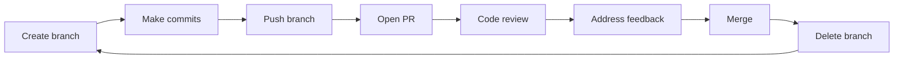
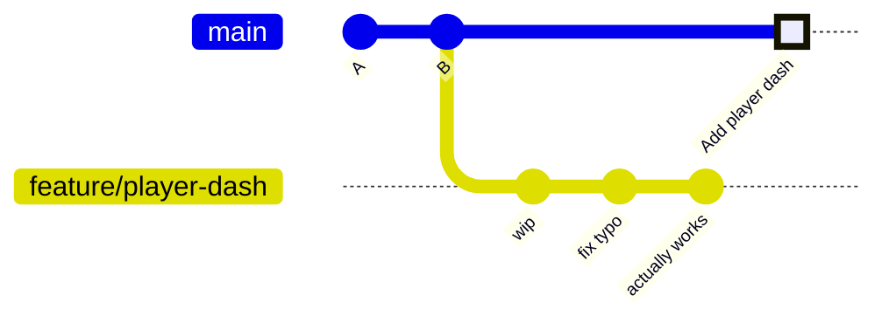

# Git Good: The PR Workflow

!!! abstract "What You Will Learn"
    By the end of this tutorial you will be able to:

    - Open a pull request and write a description reviewers can actually use
    - Understand what happens automatically when you open one
    - Give and receive code review without wasting anyone's time
    - Review changes to Unity assets, which don't show up in a diff
    - Keep your branch up to date while your PR is open
    - Understand SIGGD's merge rules and why each one exists

**Difficulty:** Intermediate · **Time:** ~35 minutes

---

## Prerequisites

Before starting, make sure you have:

- [ ] Completed [Git Good: First Commits](gitgood.md), or are already comfortable with branches and commits.
- [ ] Access to the game repository. If you don't have it yet, see [Getting Set Up](getting-set-up.md).

---

## Introduction

The previous guide was about Git: saving your work and keeping it on its own branch. This one is about GitHub, and specifically about the one process every change to the game goes through.

Nobody pushes to `main`. Not new members, not officers (we can but we won't). `main` is protected, and the only way your work becomes part of the game is a **pull request**: you propose your branch, somebody reviews it, and then it merges.

That sounds really annoying and time consuming, and on a solo project it would be. On a team this big working on one Unity project, it is the thing that stops the game being broken for everyone every other day. Additionally, your work won't get merged in if you don't follow this, so make sure to understand this guide!

---

## The PR Workflow at a Glance

Every feature or fix you work on follows this loop:


```mermaid
flowchart LR
    A["Create branch"] --> B["Make commits"]
    B --> C["Push branch"]
    C --> D["Open PR"]
    D --> E["Code review"]
    E --> F["Address feedback"]
    F --> G["Merge"]
    G --> H["Delete branch"]
    H --> A
```

An hour of work and a week of work follow the same path. The PR is where your isolated branch becomes part of the shared game.

!!! tip "Small and often beats big and rare"
    A PR that touches one system gets reviewed the same day. A PR that touches nine sits for a week because nobody has a free hour to read it. If your branch is growing in every direction, split it.

---

## Before You Open a PR

Two minutes here saves a review round trip.

**Read your own diff first.** In GitHub Desktop's **Changes** tab, or on GitHub under **Files changed**, look at everything you're about to propose. You will regularly catch debug logs you meant to remove, a file you didn't mean to touch, or an entire feature you forgot to save.

**Check for files that shouldn't be there.** Anything under `Library/`, `Temp/`, or `Logs/` is machine-specific junk and should never be committed. It's already gitignored, so if you see it in your changes, something is wrong with your setup.

**Make sure Unity actually saved.** Unity doesn't always write scene and asset changes to disk right away. Use **File &rarr; Save Project** before you commit, or Git won't see your work at all.

---

## Opening a Pull Request

Once you've pushed your branch:

=== "GitHub (web)"

    1. Go to the repository on **GitHub.com**.
    2. GitHub usually shows a banner: **"Your branch had recent pushes. Compare & pull request."** Click it.
        - If the banner isn't there, go to the **Pull requests** tab and click **New pull request**.
    3. Check that **base** is `main` and **compare** is your branch.
    4. Fill in the description, then click **Create pull request**.

    !!! info "Screenshot: PR creation"
        *`docs/assets/images/g2-web-pr-open.png` (coming soon)*
        *(Shows the "Compare & pull request" banner and the PR creation form.)*

=== "GitHub Desktop"

    After pushing, GitHub Desktop shows a **Create Pull Request** button. Clicking it opens your browser on the GitHub PR form, where you fill in the description.

!!! tip "Not finished? Open it as a draft"
    Use the dropdown next to the create button and choose **Create draft pull request**. A draft says "this is real work in progress, but don't review it yet." Reviewers aren't notified, the builds still run, and your teammates can see what you're working on so nobody duplicates it.

    When you're ready, click **Ready for review**.

!!! info "PRs update themselves"
    The PR stays open and updates every time you push to the same branch. You never need to close and reopen one.

---

## Writing a Good PR Description

When you open a PR, GitHub fills the description box with the repository's **pull request template**. Work through it rather than deleting it.

### What does this PR add or change?

Be specific about what you changed and why. This is the part reviewers (the author of this post probably) read first and rely on most.

| Vague | Specific |
|---|---|
| `"player stuff"` | `"Adds coyote-time to the player jump so the game feels less punishing at ledge edges"` |
| `"fixed bug"` | `"Fixes enemy getting stuck in wall colliders by adjusting the capsule collider offset"` |
| `"new sprites"` | `"Replaces placeholder character sprites with final pixel art for idle, run, and jump states"` |

If you made a non-obvious decision, explain it here. A good description answers review comments before they're written.

### Related issue

**Link the issue your work addresses.** Write `Closes #123` and GitHub closes that issue automatically the moment your PR merges.

This matters a lot for this project. Issues are how the project board we use in SIGGD tracks what is being worked on and what is done, so this helps a lot for organization.

Use `Related to #123` if your PR only partly addresses an issue and shouldn't close it. If there isn't an issue for what you did, delete the section if you need to.

!!! tip "No issue yet?"
    For anything bigger than a small fix, open one first. It takes a minute, it gives your work a place to be discussed, and it means somebody scanning the board can see you've got it.

### Checklist

These are here for your own use; I strongly recommend you check this before opening your PR (but I can't force you to).

- **I opened the project in Unity and my change works as expected.** You've probably already done this, but just in case.
- **No new errors in the Unity console.** Yellow warnings are not real and are probably fine. Red errors are not, unless they were there when you opened the project, in which case just ignore them (the lead team is probably already aware of those, but feel free to notify us!).
- **Every new asset has its matching `.meta` file committed.** Unity generates a `.meta` file next to every asset, holding the ID everything else uses to reference it. These absolutely need to be included in the pull request, so make sure they exist.
- **No unnecessary files are committed.** Debug scripts, test scenes, your personal editor settings, etc. If need be, you can ask a lead to add it to the .gitignore.
- **My changes are complete, modular, and abide by standard C# style guides.** Make sure your code is understandable by anyone else reading your code (yes, this means comments where necessary).
- **My branch is up to date with `main`.** Covered in [Keeping Your Branch Up to Date](#keeping-your-branch-up-to-date) below.

### Type of change

Pick whichever fits. It tells a reviewer what kind of attention your PR needs before they open the diff, since an art import and a refactor of the save system want very different eyes. You can also add your own types of changes nothing covers it.

### Screenshots or clips

For anything visual, add a screenshot or a short clip.

While we try to, reviewers would rather not boot up the game to verify your changes, and the diff of a `.prefab` or a `.png` is very unreadable. A picture is worth a thousand words, so if you can make sure to add them. Pictures sent here may also be used in our weekly highlight reels of progress made, so thats cool!

---

## What Happens Automatically

The moment you open a PR, a few things fire on their own.

**Reviewers get requested.** The `2027CodeReviewers` group is automatically added to every pull request, so you never have to figure out who to ask or chase somebody down (but still tell someone!). If you're interested, this is configured in a file called `CODEOWNERS` in the repository.

**The builds start.** GitHub automatically builds the game for Windows and macOS from your branch. This takes a while, and you'll see it running at the bottom of the PR.

**A `PR Ready` check runs.** This one is instant. It exists so that GitHub can enforce the rule that your branch has to be up to date with `main` before merging.

You'll see all of these at the bottom of the PR page:

- **Green check** — passed
- **Red X** — failed
- **Yellow dot** — still running

---

## SIGGD's Merge Rules

`main` is protected. Three rules decide when your PR can merge.

**One approval is required.**
Somebody from the review group has to approve your PR. This catches bugs before they reach everyone, and it spreads knowledge of the codebase past whoever wrote it.

**Your branch must be up to date with `main`.**
If someone else merges while your PR is open, you have to pull their changes into your branch before yours can go in. This guarantees that what gets reviewed and merged is your work combined with the current state of the game, not your work as it was a week ago.

**The builds are not required to pass.**
This one is deliberate. A red build does not block your merge.

That said, a failed build almost always means the project doesn't compile, and once that lands on `main` nobody else can work until it's fixed. Treat a red build as something to understand before merging, not something to click past. If you're not sure what it's telling you, ask.

!!! info "Why not just require the builds?"
    Unity builds are slow and bad and stupid and occasionally fail for reasons that have nothing to do with your change. Making them optional just speeds up our workflow while still giving us a place to sanity check builds.

---

## Reviewing a Pull Request

SIGGD has a group of volunteer programmers who are able to review pull requests. If you think that interests you at all, reach out to a lead and we can get you set up! However, just because you aren't a reviewer doesn't mean it's not important to know how the review process works.


To review a PR properly and thoroughly: 

1. Go to the PR and click the **Files changed** tab.
2. Read through the diff. Click the **+** on any line to comment on it.
3. To propose exact replacement code, use the suggestion button in the comment box. The author can accept it in one click.
4. Click **Review changes** at the top right to submit:
    - **Comment** — general feedback, doesn't block
    - **Approve** — good to merge
    - **Request changes** — needs work first, and blocks the merge

!!! info "Screenshot: Files changed tab with a line comment"
    *`docs/assets/images/g2-web-pr-review.png` (coming soon)*
    *(Shows the Files changed tab with a comment popup open on a line.)*

### Reviewing Unity Changes

Most of what SIGGD produces cannot be reviewed by reading a diff. A sprite shows up as an unreadable blob. A `.prefab` or `.unity` scene shows up as hundreds of lines of YAML full of numeric IDs.

For anything visual or scene-based:

- **Look at the screenshots or clip.** If the author didn't include one, ask for one. That's a reasonable review comment, not a nitpick.
- **Pull the branch and open it.** In GitHub Desktop, switch to the PR's branch from the **Current Branch** dropdown, open the project in Unity, and look at the actual thing. This is the only real way to review a scene change.
- **Check what else moved.** Scene and prefab files record far more than you changed. If a PR about a UI button also rewrote half of `Main.unity`, that's usually an accident worth asking about.
- **For imported assets, check the import settings**, not just the file. A 4096×4096 texture imported at full size for a 32-pixel icon is probably way too heavy.

!!! warning "Two people editing one scene will lose work"
    Scene and prefab files can't be meaningfully merged line by line. If two branches both change the same scene, resolving that conflict usually means one person's work is discarded.

    There's no formal system for claiming scenes in SIGGD, so make sure to do your work in separate test scenes.

### What Makes a Good Review

- **Be specific.** "This function could be cleaner" is not actionable. "This could use early returns to reduce the nesting" is.
- **Explain the why.** "Change this to a coroutine, because the current approach blocks the main thread and will cause frame stutters" teaches something. "Change this to a coroutine" is less informative.
- **Mark optional comments as optional.** Start them with `nit:` so the author knows they can move on: `"nit: this variable name could be more descriptive"`.
- **Say when something is good.** Reviewers who only ever point out problems train people to dread reviews.

### When Not to Block a PR

Don't request changes for:

- Style preferences that aren't in the team's conventions
- Things unrelated to what this PR is doing
- Hypothetical future problems that may never happen

Do request changes for:

- Bugs you can point to in the diff or reproduce
- Checklist items that clearly weren't done
- Approaches that will definitely cause problems later

For smaller comments like this, feel free to add comments as needed, just make it clear that these are just suggestions and not requirements.

---

## Responding to Review Feedback

| State | What It Means | What to Do |
|---|---|---|
| **Approved** | Good to merge | Merge when you're ready |
| **Changes requested** | Needs fixes first | Address it, push, re-request review |
| **Comment** | Feedback, nothing blocking | Read it, respond, merge if nothing is outstanding |

1. Read every comment before changing anything. Some of them are related and make more sense together.
2. Make fixes as new commits on the same branch. The PR updates when you push.
3. Reply to each comment, or mark it **Resolved** once you've handled it. Silence reads as "ignored".
4. Re-request review with the refresh icon next to the reviewer's name.

!!! warning "Don't force-push while a PR is in review"
    Force-pushing rewrites history and destroys a reviewer's ability to see what changed since they last looked. Push normal commits instead. Your messy commit history doesn't matter here, because the whole PR gets squashed into one commit when it merges.

---

## Keeping Your Branch Up to Date

Your branch has to be up to date with `main` before it can merge, and other people's PRs keep merging while yours is open. So this will come up regularly.

=== "GitHub Desktop"

    1. Make sure you're on your feature branch.
    2. Go to **Branch &rarr; Update from main**.
    3. Resolve any conflicts if prompted, then push.

    !!! info "Screenshot: Update from main"
        *`docs/assets/images/g2-desktop-update-branch.png` (coming soon)*
        *(Shows the "Update from main" option in the Branch menu.)*

=== "CLI"

    ```bash
    git fetch origin
    git merge origin/main
    git push
    ```

If this produces conflicts, resolve them the same way as in [Git Good: First Commits](gitgood.md#merge-conflicts). Doing this regularly is much less painful than doing it once at the end, when a month of other people's changes land on you at the same time.

---

## How SIGGD Merges: Squash

When your PR is approved, it gets **squash merged**. Every commit on your branch is combined into a single commit on `main`.


```mermaid
gitGraph
   commit id: "A"
   commit id: "B"
   branch feature/player-dash
   checkout feature/player-dash
   commit id: "wip"
   commit id: "fix typo"
   commit id: "actually works"
   checkout main
   commit id: "Add player dash" type: HIGHLIGHT
```

Two things follow from this, and they're the only parts you need to remember:

**Your branch history doesn't matter.** Commit as messily as you like while you work. `wip`, `oops`, `actually works` — none of it reaches `main`. This is why you arent strictly required to clean up your commits before opening a PR (though it's recommended to do so for your own sake!).

**Your PR title becomes the commit message on `main`,** so give the PR a real title. I recommend prefixing your pull requests with identifiers like `fix:` or `feat:` to make it extra clear what your PR is working on.

!!! tip "Delete your branch after merging"
    GitHub offers a **Delete branch** button once the PR is merged. Click it. The work is safely on `main`, and it keeps the branch list readable. Not required, but it does help!

??? note "For reference: the other two merge strategies"
    SIGGD uses squash merging, so you don't need these. They're here because you'll meet them on other projects.

    **Merge commit** keeps every commit from the branch and adds a merge commit tying the histories together. The history graph branches and rejoins, which preserves exactly how the work happened at the cost of a noisier log.

    ```mermaid
    gitGraph
       commit id: "A"
       commit id: "B"
       branch feature
       checkout feature
       commit id: "C"
       commit id: "D"
       checkout main
       merge feature id: "Merge feature"
    ```

    **Rebase and merge** replays each of your commits one at a time on top of the latest `main`, with no merge commit. The history stays perfectly linear and every commit is preserved, but the commits are rewritten, so they get new hashes and are technically not the same commits any more.

    ```mermaid
    gitGraph
       commit id: "A"
       commit id: "B"
       commit id: "C-prime"
       commit id: "D-prime"
    ```

    | Strategy | History | Individual commits kept |
    |---|---|---|
    | **Squash** | Linear, one commit per PR | No, collapsed into one |
    | **Merge** | Branching | Yes |
    | **Rebase** | Linear | Yes, but rewritten |

---

## When a Check Fails

1. Click **Details** next to the failed check to open the log.
2. Scroll to the first red error. Later errors are usually caused by the first one.
3. Fix it on your branch and push. The checks re-run automatically on every push.

The most common cause of a failed build is a compile error, and the log will name the file and line. If the error doesn't mention any of your files, or it looks like the build machine had a problem rather than your code, say so in the PR and ask.

---

## Undoing Mistakes

### Undo the Last Commit (Not Yet Pushed)

=== "GitHub Desktop"

    In the **History** tab, right-click the last commit and choose **Undo Commit**. Your changes come back as staged, nothing is lost.

=== "CLI"

    ```bash
    git reset HEAD~1
    ```

    This un-commits and returns the changes to your working directory. Nothing is deleted.

### Remove a File You Committed by Accident

This happens constantly. `git add .`, or ticking everything in GitHub Desktop, sweeps up files you never meant to include: a debug script, a test scene, a texture you were experimenting with, your personal editor settings.

**If you haven't pushed yet**, undo the commit, deselect the extra files, and commit again.

=== "GitHub Desktop"

    1. In the **History** tab, right-click the commit and choose **Undo Commit**. Everything comes back to the **Changes** tab, still selected.
    2. **Uncheck** the files you didn't mean to include.
    3. Write your message again and commit.

    The unchecked files stay on your machine as uncommitted changes. Nothing is lost.

=== "CLI"

    ```bash
    git reset HEAD~1                # un-commit, keep every change
    git add PlayerController.cs     # stage only what you meant to
    git commit -m "Add player dash ability"
    ```

**If you already pushed**, don't try to rewrite history — your branch is probably in review, and force-pushing wrecks that. Just remove the file in a new commit on top:

=== "GitHub Desktop"

    Delete the file in your file explorer, then commit that deletion and push. The removal becomes part of the PR like any other change.

=== "CLI"

    ```bash
    git rm --cached Assets/Scripts/DebugSpawner.cs
    git commit -m "Remove accidentally committed debug script"
    git push
    ```

    `--cached` untracks the file but leaves it on your disk, which is usually what you want for something you still use locally.

!!! tip "Squash merging cleans this up for you"
    Because SIGGD squash merges, a file that was added and then removed within the same PR never reaches `main` at all. The final commit is the difference between your finished branch and `main`, so your "oops" and your "remove oops" cancel out.

!!! danger "This is not enough for passwords or keys"
    If you committed something genuinely sensitive, removing it in a later commit does **not** make it private. It stays visible in your branch's commit history on GitHub, and the repository is public. Tell a lead immediately rather than trying to clean it up yourself, and treat the secret as compromised.

### Stop Tracking a File That Keeps Coming Back

If a file shouldn't be in the repo at all but you need it locally, untrack it and add it to `.gitignore` so it stops reappearing in your changes:

```bash
git rm --cached path/to/file
```

Then add the file or folder to `.gitignore` and commit both. If you find yourself doing this for something everyone will hit, mention it, since the fix probably belongs in the shared `.gitignore` rather than in each person's working copy.

### Revert a Commit (Already Pushed)

=== "CLI"

    ```bash
    git revert abc1234   # the commit hash from git log
    ```

    `git revert` creates a **new** commit that undoes an old one. The original stays in history. This is the safe option on shared branches.

=== "GitHub (web)"

    On a merged PR, click **Revert** to open a revert PR automatically.

### Fix the Last Commit Message (Not Yet Pushed)

```bash
git commit --amend -m "Better message"
```

!!! warning "`git reset --hard` deletes your work"
    `git reset --hard HEAD~1` removes the last commit **and** discards the changes permanently. There is no undo. Use `git reset HEAD~1` without `--hard` to un-commit but keep your work.

---

## Stashing Changes

Sometimes you're mid-task and need to switch branches right now, to review someone's PR or check something, but you're not ready to commit.

**Stash** is a temporary clipboard for uncommitted changes.

=== "GitHub Desktop"

    Right-click in the **Changes** tab and choose **Stash All Changes**.

    To restore: click **Stashed Changes** at the bottom of the Changes tab, then **Restore**.

=== "CLI"

    ```bash
    git stash              # put changes aside
    git stash pop          # bring them back
    git stash list         # see everything stashed
    ```

!!! tip "Name your stashes"
    Unnamed stashes become a mystery pile fast:

    ```bash
    git stash push -m "wip: player movement refactor"
    ```

---

## Next Steps

- Review somebody else's open PR. It's the fastest way to learn parts of the project you haven't touched.
- [GitHub Actions documentation](https://docs.github.com/en/actions): how the automated builds on each PR actually work.

---

## Further Reading

- [GitHub Docs: About pull requests](https://docs.github.com/en/pull-requests/collaborating-with-pull-requests/proposing-changes-to-your-work-with-pull-requests/about-pull-requests): the official reference for everything PR-related.
- [Oh Shit, Git!?!](https://ohshitgit.com/): plain-English fixes for common Git mistakes.
