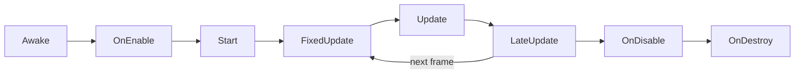

# How Unity Thinks

!!! abstract "What You Will Learn"
    By the end of this guide you will be able to:

    - Describe any Unity scene as GameObjects built out of components
    - Predict which fields of a script show up in the Inspector, and why
    - Explain where Inspector values actually live (and why Play Mode edits vanish)
    - Predict the order Unity calls `Awake`, `OnEnable`, `Start`, and `Update`
    - Decide what should be a prefab, a prefab variant, or just an override

**Difficulty:** Beginner · **Time:** ~45 minutes

---

## How to Use This Guide

You don't need Unity open for any of this. Every section is a short explanation followed by an exercise:

- **Predict:** read some code or a scenario and write down what you think will happen *before* you open "Check your prediction". I'd recommend committing to an answer, on paper or in a notes app or mentally. The wrong guesses are where most of the learning happens anyways (I hope).
- **Make:** a small design exercise. There's no answer key for these on purpose; if you're stuck, open the hints one at a time, and when you're done, check your work against "What a good answer includes". A lot of these can also be made in Unity if you want to get some practice with the engine.
- **Try it in Unity:** if Unity is ready on your machine, these let you check your predictions for real and figure out what's actually going on. If it isn't, you won't miss anything; this guide also works as a mental learning exercise on how to interpret Unity.

This guide is intended to be for completely fresh Unity users, so if you already know something here, feel free to skip around! I do think there is value from reading this as an experienced person as well, however!

!!! tip "Compare notes"
    If someone's sitting next to you, talk to them! Programming is actually a super collaborative task, and it helps a lot to talk to others about what you're doing.

---

## Introduction

If you've written programs before, you're probably used to a `main()` function where everything starts, and code that runs top to bottom. Unity doesn't work like that. There's no `main()` for you to write. Instead, you build a world out of objects, attach small scripts to them, and Unity calls those scripts at specific moments: when an object is created, every frame, when it's destroyed, and so on.

Almost every "why isn't this working" moment new Unity programmers have comes from expecting the first model while Unity runs the second one. So before we write any real code, I want you to have the mental model of what a scene is made of, where data lives, and when your code actually runs.

---

## Scenes Are Made of GameObjects

A **scene** is a level, a menu, or any other self-contained chunk of your game. Open one and you'll see the **Hierarchy**: a list of **GameObjects**.

A GameObject, on its own, does nothing. It has a name, and it always has a **Transform** (its position, rotation, and scale), and that's it, a container.

??? info "New to this? A GameObject is a labeled box"
    Picture an empty cardboard box with a name written on it, sitting at a spot in the world. The box itself can't do anything. Everything interesting comes from what you put inside it, and in Unity, what you put inside are components.

---

## Components Do the Work

Everything a GameObject can do comes from its **components**. A few you'll see constantly:

| Component | What it gives the GameObject |
|---|---|
| `SpriteRenderer` / `MeshRenderer` | Something to look at |
| `Collider` (box, sphere, capsule...) | A shape that things can bump into |
| `Rigidbody` | Physics: gravity, forces, being pushed around |
| `AudioSource` | The ability to play sound |
| Your own scripts | Whatever behavior you write |

So a player might be one GameObject with a `SpriteRenderer`, a `Rigidbody2D`, a `CapsuleCollider2D`, a `PlayerMovement` script, and a `Health` script. An enemy might have a completely different movement script but the *same* `Health` script. That's the core idea of Unity: **a thing is what it's made of.** Instead of building a big class hierarchy (`Player` inherits from `Character` inherits from `Entity`), you assemble objects out of small pieces that each do one job.

This idea has a name, the [Component pattern](https://gameprogrammingpatterns.com/component.html), and Unity's whole architecture is built around it.

!!! question "Predict: the crate"
    A crate in your level has a `MeshRenderer` and a `BoxCollider`, but no `Rigidbody`. The player (who does have physics) walks into it.

    1. What happens to the player, and what happens to the crate?
    2. You add a `Rigidbody` to the crate. What changes?
    3. Instead, you remove the crate's `MeshRenderer` but keep the collider. What does the player experience?

??? success "Check your prediction"
    1. The player stops, and the crate doesn't move at all. A collider with no `Rigidbody` is treated as a static part of the level, like a wall.
    2. Now the crate falls under gravity and gets shoved when the player pushes it. The `Rigidbody` is the part that says "physics applies to me."
    3. An invisible wall. The collider still blocks the player; there's just nothing to see.

    Each component adds exactly one capability. Remove a component and you remove exactly that capability, and nothing else. Keep that in mind, because it's also a great rule for the scripts you write.

!!! example "Make: take apart a game you know"
    Pick one moment from a game you've played: a room in a roguelike, a boss arena, a dialogue scene, anything. Find a screenshot of it online (or open it up yourself). Then:

    1. List every GameObject you think is in that scene, including ones you can't *see*.
    2. For each one, list the components it needs.
    3. Mark any component that shows up on more than one kind of object.

??? tip "Hint 1"
    Start with what's visible, then ask: what's making things happen that I *can't* see? Who spawns the enemies? What's playing the music? What keeps track of the score?

??? tip "Hint 2"
    Invisible GameObjects are completely normal. Spawners, trigger zones, managers, and music players are usually GameObjects with no renderer at all. And a component should do one job, the way a `Collider` only handles shape. Unity's manual page on [GameObjects](https://docs.unity3d.com/6000.3/Documentation/Manual/GameObjects.html) has a good overview.

??? tip "Hint 3"
    Go object by object and ask four questions: does it need to be *seen*, to be *touched*, to *do* something, and to *remember* something? Each "yes" is usually a component. A coin needs to be seen (`SpriteRenderer`), to be touched (a `Collider` set as a trigger), and to do something when touched (a `Coin` script that adds to the score).

??? note "What a good answer includes"
    - At least one GameObject with nothing visible (a spawner, a trigger zone, a manager).
    - At least one component reused across different kinds of objects, like `Health` on the player and the enemies.
    - No component described as doing several unrelated jobs. "PlayerController moves, attacks, plays the music, and saves the game" should really be four components.
    - Script names that say what they do (`EnemySpawner`), not vague ones (`Manager2`).

---

## The Transform Hierarchy

GameObjects can be parented to other GameObjects. A child moves, rotates, and scales along with its parent, which is how a sword stays in a character's hand or a health bar floats over an enemy's head.

This gives every GameObject two ways to describe where it is:

- **World position:** where it actually is in the scene (`transform.position`).
- **Local position:** where it is *relative to its parent* (`transform.localPosition`).

So game development is actually secretly just math class (mostly linear algebra). Don't you love math? Surprise pop quiz:

!!! question "Predict: parent and child"
    An empty parent GameObject sits at world position `(10, 0, 0)` with a scale of `1`. Its child sits at local position `(2, 0, 0)`.

    1. What's the child's world position?
    2. The parent's scale changes to `2`. What's the child's world position now? What's its local position? What happens to how big it looks?

??? success "Check your prediction"
    1. `(12, 0, 0)`. The child's local offset of 2 gets added to the parent's position.
    2. The child's world position becomes `(14, 0, 0)`, because the parent's scale stretches the offset too. Its local position is still `(2, 0, 0)`, since nothing about its relationship to the parent changed, and it looks twice as big because children inherit their parent's scale.

    Rotation works the same way: rotate the parent and the child swings around it like it's on an invisible arm. That's why mixing up `position` and `localPosition` in code is top 5 bugs ever; they're both correct, just measured from different places.

---

## Scripts Are Components Too

When you write a class that inherits from `MonoBehaviour`, you've made a component. You add it to a GameObject exactly like a `Collider` or an `AudioSource`, and Unity creates the instance for you.

Two things to keep in mind:

- **The file name has to match the class name.** `Turret.cs` must contain `class Turret`, or Unity won't let you add it to anything. (The [C# Style Guide](csharp-style-guide.md#files-and-namespaces) has more.)
- **You never write `new Turret()`.** Unity logs a warning if you try, and you end up with a broken object that isn't attached to anything. Components come from adding them in the editor, from `AddComponent`, or from spawning a prefab.

The other big thing a MonoBehaviour gets you is the **Inspector**, where some of its fields appear, and where you (and designers) can change them without touching code. But not every field shows up.

!!! question "Predict: what shows up in the Inspector?"
    You add this script to a GameObject. Which of these eight members show up in the Inspector?

    ```csharp
    using UnityEngine;

    public class Turret : MonoBehaviour
    {
        public float range = 10f;
        [SerializeField] private float fireRate = 2f;
        private int shotsFired;
        public static int TurretCount;
        public const float MaxRange = 50f;
        public readonly float Damage = 5f;
        public float Cooldown { get; set; }
        [field: SerializeField] public int Ammo { get; private set; } = 30;
    }
    ```

    (Yes I know that `public float range` breaks two rules in the style guide I meticulously wrote. It's here because you'll see it in basically every Unity tutorial ever.)

??? success "Check your prediction"
    Three of them: `range`, `fireRate`, and `Ammo`.

    Unity [serializes](https://docs.unity3d.com/6000.3/Documentation/Manual/script-serialization-rules.html) (saves, and shows in the Inspector) a field when it's `public` or marked `[SerializeField]`, *and* it isn't `static`, `const`, or `readonly`. So:

    - `range` is public. It shows up.
    - `fireRate` is private, but `[SerializeField]` opts it in. It shows up. This is the version you should actually write.
    - `shotsFired` is private with no attribute. Hidden.
    - `TurretCount` is static, so it belongs to the class rather than any one turret. Hidden.
    - `MaxRange` is a constant and can never change, so there's nothing to save. Hidden.
    - `Damage` is readonly, so Unity can't write a saved value back into it. Hidden.
    - `Cooldown` is a property, and Unity doesn't save properties. Hidden.
    - `Ammo` is a property too, but `[field: SerializeField]` tells Unity to save the hidden field behind it, so it shows up. I also recommend using this one.

??? tip "Try it in Unity"
    Create a new project from Unity Hub with any 2D/3D template (Universal 2D/3D is a safe choice). Go to **Assets &rarr; Create &rarr; Scripting** and create a MonoBehaviour script named `Turret`, paste the code in, and drag it onto any GameObject in the scene. Check the Inspector against your prediction.

---

## The Inspector Is Data, Not Code

Here's a mental shift that saves a lot of confusion: when you change a value in the Inspector, you're not editing your script. You're editing **data saved in the scene (or prefab) file**. The `= 10f` in your code is only a *default*, used when the component is first added.

!!! question "Predict: the changed default"
    Your `Turret` has `public float range = 10f;`. You add it to three turret GameObjects in a scene, and set the third one's range to `25` in the Inspector. Save the scene.

    Later, you change the code to `public float range = 15f;`.

    1. What's the range on each of the three turrets now?
    2. What range does a brand-new fourth turret get?

??? success "Check your prediction"
    1. `10`, `10`, and `25`. Nothing changed. When the scene was saved, every turret's range was written into the scene file, and that saved value wins over the code's default.
    2. `15`. The default only matters when a component is first created.

    If you want to change existing objects, change them in the Inspector (or in the prefab, which you'll see below).

!!! question "Predict: Play Mode tweaking"
    You press Play, and the turret fires too slowly. While the game is running, you bump `fireRate` from `2` to `5` in the Inspector. It feels great. You stop Play Mode.

    What's `fireRate` now?

??? success "Check your prediction"
    It's back to `2`. Any change you make to scene objects while in Play Mode is thrown away when you stop. Play Mode is a sandbox: tweak freely to find values you like, but write them down (or copy the component's values) before you stop, then set them again in Edit Mode.

    One exception you'll meet soon: changes to **ScriptableObject assets** *do* stick around after Play Mode ends. That's handy and occasionally dangerous, but this will show up later.

??? tip "Try it in Unity"
    Put the `Turret` on a cube, press Play, change `fireRate` in the Inspector, and stop. While you're at it, I'd recommend setting a Play Mode tint (under **Preferences &rarr; Colors**) so the editor turns a different color while the game is running. It makes it much harder to forget you're in Play Mode.

---

## The Lifecycle

Since there's no `main()`, Unity calls specific methods on your scripts at specific moments. You don't subscribe to anything; if your MonoBehaviour has a method with the right name, Unity calls it. These are the ones you'll use most:

| Method | When Unity calls it |
|---|---|
| `Awake` | Once, when the object is loaded or created, *even if this script component is disabled* (as long as the GameObject is active) |
| `OnEnable` | Every time the component becomes enabled and active |
| `Start` | Once, just before the component's first `Update`, but only once the component is enabled |
| `FixedUpdate` | Every physics step, which might be zero, one, or several times per frame |
| `Update` | Every frame |
| `LateUpdate` | Every frame, after every `Update` has run |
| `OnDisable` | When the component is disabled or its GameObject is deactivated |
| `OnDestroy` | When the object is destroyed |



??? info "New to this? What's a frame?"
    A game redraws the screen many times per second, and each redraw is a **frame**. At 60 frames per second, `Update` runs about 60 times a second. Physics runs on its own fixed clock (`FixedUpdate`), which is why the two can run a different number of times.

!!! question "Predict: two loggers"
    This script logs a message from each method:

    ```csharp
    using UnityEngine;

    public class LifecycleLogger : MonoBehaviour
    {
        private bool hasLoggedUpdate;

        private void Awake() => Debug.Log($"{name}: Awake");
        private void OnEnable() => Debug.Log($"{name}: OnEnable");
        private void Start() => Debug.Log($"{name}: Start");

        private void Update()
        {
            if (!hasLoggedUpdate)
            {
                Debug.Log($"{name}: first Update");
                hasLoggedUpdate = true;
            }
        }
    }
    ```

    The scene has two GameObjects, **A** and **B**, each with a `LifecycleLogger`. On **B**, the `LifecycleLogger` component is *disabled* (its checkbox in the Inspector is unticked). Both GameObjects are active.

    Write down every line you expect in the Console after pressing Play, in order.

??? success "Check your prediction"
    You'll see something like:

    ```
    A: Awake
    B: Awake
    A: OnEnable
    A: Start
    A: first Update
    ```

    Three things are worth noticing:

    1. **B's `Awake` runs even though its component is disabled.** `Awake` belongs to the object being loaded, not to the component being enabled. B never gets `OnEnable`, `Start`, or `Update`, until something enables it.
    2. **A and B might print in the other order.** Unity [explicitly doesn't guarantee](https://docs.unity3d.com/6000.3/Documentation/ScriptReference/MonoBehaviour.Awake.html) which object's `Awake` runs first, so your code can't rely on it.
    3. **Every `Awake` happens before any `Start`.** Unity doesn't call `Start` on anything until `Awake` has run on every object in the scene.

    Points 2 and 3 together give you the easiest solution to all sorts of race condition problems: **set yourself up in `Awake`, and talk to other objects in `Start`.** In `Awake`, the object you want to talk to might not exist yet. By `Start`, everybody's `Awake` is guaranteed to be done.

??? tip "Try it in Unity"
    Make two cubes named A and B, add `LifecycleLogger` to both, untick it on B, and press Play. Then, while the game is running, tick B's checkbox and watch its `OnEnable` and `Start` show up.

!!! example "Make: the enemy registry"
    A `GameManager` needs to know about every enemy in the level, so it keeps a list. Each `Enemy` adds itself to that list when it appears, and removes itself when it's gone.

    Decide which lifecycle method each of these belongs in, and make sure you know why:

    1. The `GameManager` creating its empty list.
    2. An `Enemy` adding itself to the list.
    3. An `Enemy` removing itself from the list.

??? tip "Hint 1"
    For each step, ask: what has to *already exist* for this to work? Then find the earliest method where that's guaranteed.

??? tip "Hint 2"
    Remember the two guarantees from the prediction above: the order of different objects' `Awake` calls is random, but every `Awake` finishes before any `Start`. Also think about enemies that get disabled and re-enabled (a pooled enemy, say), not just ones that are created and destroyed. The [execution order page](https://docs.unity3d.com/6000.3/Documentation/Manual/execution-order.html) has the full explanation if you're curious.

??? tip "Hint 3"
    The list is the manager's own setup, so it doesn't depend on anyone else. An enemy registering depends on the manager's list existing, which is only guaranteed after every `Awake`. For removal, think about which method is the natural "undo" of the one you picked for adding, so that disabling and re-enabling an enemy doesn't register it twice.

??? note "What a good answer includes"
    - The manager's list is created in the manager's own setup (its `Awake`, or even right where the field is declared).
    - No enemy touches the manager during its own `Awake`, because the manager might not be set up yet.
    - If you used `OnEnable` anywhere, you've accounted for the fact that at scene start it runs right after that same object's `Awake`.
    - Adding and removing mirror each other, and you can say exactly what happens under your choice to an enemy that's disabled and re-enabled (like a pooled one).
    - Your justifications talk about what's *guaranteed*, not what happened to work when you tried it once.

---

## Prefabs

A **prefab** is a GameObject (with all its components and children) saved as an asset, so you can stamp out copies of it. Each copy in a scene is a **prefab instance**, and instances stay linked to the prefab: change the prefab and every instance updates.

Instances can still **override** individual values. Overridden values show up in bold in the Inspector, with a blue line next to them. And when you want a reusable "same thing, but different" version, like a Spear Goblin based on a Goblin, you make a **prefab variant**: a prefab built on top of another prefab.

!!! question "Predict: the mini-boss"
    Your `Goblin` prefab has a `Health` component with a max health of `30`. You place 20 goblins in a level. On one of them, the mini-boss, you change max health to `100` in the Inspector.

    Later, you open the `Goblin` prefab and change its max health to `40`. What's the max health of each of the 20 goblins?

??? success "Check your prediction"
    Nineteen goblins now have `40`, and the mini-boss still has `100`.

    An instance only stores what's *different* about it (its overrides). Everything else comes from the prefab, so the 19 untouched goblins pick up the change immediately. The mini-boss's max health was overridden, and Unity's rule is that [an override always wins](https://docs.unity3d.com/6000.3/Documentation/Manual/PrefabInstanceOverrides.html) over the prefab's value.

    That's great when it's what you want, and a super annoying bug when it isn't: if you accidentally modify a value on some instance, prefab changes will ignore it.

!!! example "Make: prefabs, variants, or overrides?"
    Go back to the scene you took apart earlier. For each object, decide:

    1. Should it be a prefab?
    2. Would any prefabs make good variants of each other?
    3. Which differences are just per-placement tweaks (overrides) rather than a new kind of thing (a variant)?

??? tip "Hint 1"
    Ask: if I placed this object twice, would I want a fix to one of them to fix both?

??? tip "Hint 2"
    Variants are for *kinds* of things you'll reuse ("Spear Goblin" everywhere), and overrides are for one specific placement ("this particular goblin guards the door, so it's tougher"). The [Prefabs manual page](https://docs.unity3d.com/6000.3/Documentation/Manual/Prefabs.html) covers both.

??? tip "Hint 3"
    If you'd find yourself making the same five overrides on every instance of something, that's a variant asking to exist. If a change only makes sense for one spot in one level, it's an override.

??? note "What a good answer includes"
    - Anything that appears more than once is a prefab.
    - Variants for reusable kinds that share most of their structure, not for one-off tweaks.
    - Overrides for placement-specific changes, and a reason why each one isn't a variant.
    - A few things that aren't prefabs at all, because they only ever exist once and never get spawned (though even those are often prefabs so they're easy to reuse across scenes, which is a fine answer too).

---

## Two Things You'll Meet Next

**ScriptableObjects.** Not everything lives in a scene. A ScriptableObject is an *asset*, like a texture or a sound, that holds data instead of pixels. A spell's damage and cooldown, an enemy type's stats, a level's settings: all good ScriptableObject material, shared by everything that references them. [Data-Driven Design](data-driven-design.md) explains this in much more detail.

**How objects find each other.** A turret needs to know where the player is, and a health bar needs to know when health changes. The three most common ways are a serialized reference (drag the object into a field in the Inspector), `GetComponent` (grab another component on the same GameObject), and events (announce that something happened and let whoever cares listen). Choosing between them is a big part of [The OOP Toolkit](oop-toolkit.md).

---

## Going Further

If you finished early, or this was all familiar:

- **[C# for Unity](csharp-for-unity.md):** the language-level stuff (properties, events, structs, and Unity's strange version of `null`), especially if you're coming from Java, Python, or C++.
- **[Thinking Like an Engineer](thinking-like-an-engineer.md):** why "a thing is what it's made of" is a good idea far beyond Unity.
- **The [execution order page](https://docs.unity3d.com/6000.3/Documentation/Manual/execution-order.html)** has the complete lifecycle diagram, including the physics and rendering steps this guide skipped.

---

## Next Steps

- [Designing a System](designing-a-system.md): next meeting, we use this mental model to design a system for this week's game idea.
- [C# Style Guide](csharp-style-guide.md): how we write the scripts you've been reading.

---

## Further Reading

- [Unity Manual: GameObjects](https://docs.unity3d.com/6000.3/Documentation/Manual/GameObjects.html): the official explanation of GameObjects as containers for components.
- [Unity Manual: Prefabs](https://docs.unity3d.com/6000.3/Documentation/Manual/Prefabs.html): instances, overrides, nesting, and variants in depth.
- [Unity Manual: Script serialization rules](https://docs.unity3d.com/6000.3/Documentation/Manual/script-serialization-rules.html): exactly what Unity saves and shows in the Inspector.
- [Unity Manual: Event function execution order](https://docs.unity3d.com/6000.3/Documentation/Manual/execution-order.html): the full lifecycle.
- [Game Programming Patterns: Component](https://gameprogrammingpatterns.com/component.html): Robert Nystrom's chapter on the pattern Unity is built around, and a great read in general.
